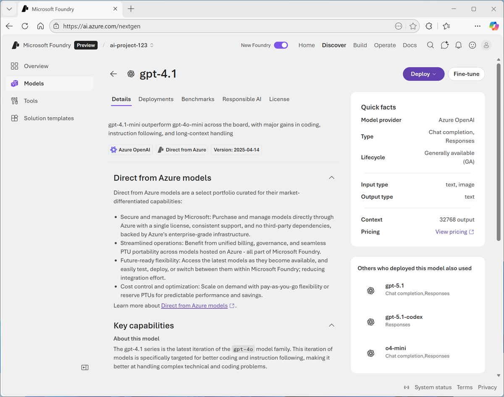
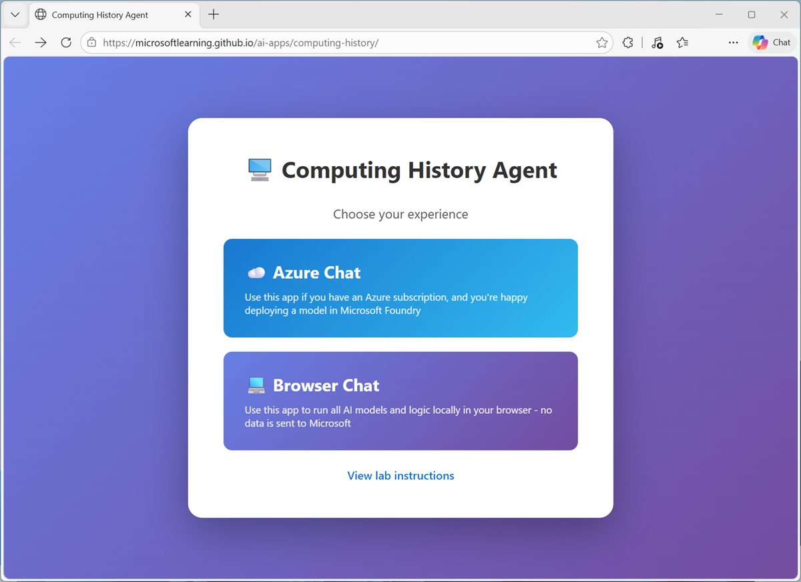

---
lab:
    title: 'Explore AI workloads'
    description: 'See what AI can do by exploring a simple AI app.'
    duration: 15
    level: 100
---

# Explore AI workloads

In this exercise, you'll explore common AI workloads in an AI chat application that provides information about computing history, and help with historical computing projects and vintage computer restoration.

> **Note**: The Computing History app is provided in two variants: An Azure-based solution that uses a model and tools in Microsoft Foundry, and a browser-based solution that downloads and runs models locally in your web browser. To use the Azure-based application, you require an Azure subscription in which to create a Foundry project and deploy a model. The browser-based application has some functional and performance limitations, but is designed to work in most modern browsers with no subscription or setup required.

This exercise should take approximately **15** minutes to complete.

## Create a Microsoft Foundry project and deploy a model

To use the Azure-based computing history app, you need a generative AI model deployed in Microsoft Foundry.

> **Tip**: You need only complete this procedure if you want to use the Azure-based application. If you do not have an Azure subscription, or want to perform the lab completely in-browser, skip to the **Open the Computing History app** section.

1. In a web browser, open [Microsoft Foundry](https://ai.azure.com){:target="_blank"} at `https://ai.azure.com` and sign in using your Azure credentials. Close any tips or quick start panes that are opened the first time you sign in, and if necessary use the **Foundry** logo at the top left to navigate to the home page.

1. If it is not already enabled, in the tool bar the top of the page, enable the **New Foundry** option. Then, if prompted, create a new project with a unique name; expanding the  **Advanced options** area to specify the following settings for your project:
    - **Foundry resource**: *Enter a valid name for your AI Foundry resource.*
    - **Subscription**: *Your Azure subscription*
    - **Resource group**: *Create or select a resource group*
    - **Region**: Select any of the **AI Foundry recommended** regions

1. Select **Create**. Wait for your project to be created. It may take a few minutes. After creating or selecting a project in the new Foundry portal, it should open in a page similar to the following image:

    

1. In the **Start building** menu, select **Browse models** to view the Microsoft Foundry model catalog.

1. Search for and select the `gpt-4.1-mini` model, and view the page for this model, which describes its features and capabilities.

    

1. Use the **Deploy** button to deploy the model using the default settings. Deployment may take a minute or so.

    > **Tip**: Model deployments are subject to regional quotas. If you don't have enough quota to deploy the model in your project's region, you can use a different model - such as gpt-4.1, or gpt-4o. Alternatively, you can create a new project in a different region.

1. When the model has been deployed, view the model playground page that is opened, in which you can chat with the model.

    

    Note the deployment name for your model (which by default is the same as the model name) is selected in the pane on the left.

1. In the toolbar at the top of the Foundry portal, select your project to return to the home page.
1. Note the following details for your project:
    - **Project endpoint**: The URL where your project resource can be accessed.
    - **Project API key**: The authentication key used to access your resource.
    - **Project region**: The region where your project is deployed.

    You'll need these values to configure the Computing History application.

## Open the Computing History app

The Computing History app is a simple example of an AI agent that provides a chat interface for exploring AI history and vintage computers.

> **Note**: The Computing History app is provided solely as a simple example of a chat-based agent for this exercise. It is not a supported Microsoft product or service, and should not be replied on for critical work.

1. In a web browser, open the **[Computing History app](https://aka.ms/computing-history){:target="_blank"}** at `https://aka.ms/computing-history`.
1. Wait for the model to download and initialize.

   

1. Select the version of the application you want to use:
    - Selecting **Azure Chat** opens the Azure-based application, and displays the **Configuration** page where you must enter the project details and model name for your Foundry project.

        Copy the details from the Foundry Portal, and save the configuration. Note that the endpoint, region, and model name will be saved in your local browser cache; but you must re-enter the project API key if you close and reopen the app.

    - Selecting **Browser Chat** opens the browser-based application and downloads the required models

        The first time you download a model, it may take several minutes. Subsequent downloads will be faster.

## Explore a generative AI model

Generative AI uses *large language models* (LLMs) like GPT-4.1-mini and more compact *small language models* (SLMs) like SMOLLMV2 to respond to user *prompts*. 

1. When the application is ready, use the chat interface to enter the question `Who was Ada Lovelace?` and review the responses returned by the agent.

   

    > **Note**: Responses in the browser-based application may be slow.

1. Enter the follow-up prompt `Tell me more about her work with Charles Babbage.` and view the response. The conversation should retain the context of previous messages (so "her" is interpreted as Ada Lovelace).

    **Suggestions for other prompts to try:**
    
    - `What was Alan Turing's contribution to AI?`
    - `Tell me about the ELIZA chatbot.`
    - `What was ENIAC?`
    - `Can you tell me anything about Grace Hopper?`

## Explore an agent with tools

Agents are generative AI applications that go beyond basic chat functionality and support the use of *tools* to retrieve knowledge outside of the model's training data as well as to automate tasks.

1. In the Computing History app, use the **Restart conversation** (&#128172;) button to clear the conversation history.
1. Use the **View agent instructions** (&#128195;) button to view the agent configuration details, which consist of:
    - A **model** with which to reason and generate text.
    - **Instructions** to guide behavior and expected functionality.
    - **Tools** with which to retrieve knowledge or perform tasks.

    Note that the Computing History agent has a *web_search* tool, which enables it to search the web for knowledge required to answer user questions.

1. Enter the prompt `Search for "Commodore 64".` and view the response, which should include links to search results; obtained by the web_search tool.
1. Now try `Search for a Commodore 64 for sale on ebay.` and view the response.

    **Suggestions for other prompts to try:**
    
    - `Find "Sinclair ZX Spectrum" on the web.`
    - `Search for vintage Microsoft logos.`

## Explore text analysis

Text analysis is a subset of natural language processing, in which AI can apply various analytical techniques to summarize, categorize, and extract details from text.

1. In the Computing history application, use the **Restart conversation** (&#128172;) button to clear the conversation history.
1. Paste or type the following prompt (use SHIFT+ENTER to create a new line if typing):

    ```
    Summarize the following text, and then list the key people, places, and dates it references:
    
    Artificial intelligence (AI) has evolved through several pivotal eras shaped by visionary pioneers, technological breakthroughs, and shifting research priorities. Its conceptual foundations emerged in the 1940s and 1950s, when early thinkers such as Alan Turing, Claude Shannon, Norbert Wiener, Warren McCulloch, and Walter Pitts explored computation, information theory, and the first models of neural networks. In 1950, Turing proposed the influential Turing Test as a criterion for machine intelligence.

    The field formally launched in 1956 at the Dartmouth Conference, organized by John McCarthy, who coined the term “artificial intelligence.” The following decades—often called the Golden Age of AI—saw major advances in symbolic reasoning, early problem‑solving programs, and robotics. Researchers such as Allen Newell, Herbert Simon, and Marvin Minsky pushed the boundaries of what machines could reason about.

    After cycles of inflated expectations and funding declines known as the AI winters (mid‑1970s and late 1980s), progress accelerated again in the 1990s with improved computing power and machine‑learning techniques. Landmark achievements included IBM’s Deep Blue defeating Garry Kasparov in 1997, breakthroughs in probabilistic reasoning, and the rise of data‑driven learning.
    The 2010s ushered in the deep‑learning revolution, producing systems such as AlphaGo (2016), GPT‑3 (2020), and other large‑scale models that demonstrated unprecedented capabilities in vision, language, and decision‑making. Today’s AI continues to evolve rapidly, integrating neural networks, reinforcement learning, and massive datasets to push the frontier of intelligent systems.
    ```

1. Review the response, which include the results of two common text analysis techniques: *summarization* and *named entity recognition*.

    > **Note**: The Azure-based application uses its generative AI model to perform text analysis techniques. The browser-based version detects promptsthat start with "summarize" and then uses statistical techniques and JavaScript NLP packages to perform an extractive summary and extract entities.

    **Suggestions for other prompts to try:**

    ```
    Summarize this article, and use named entity recognition to identify people, places, and dates:

    Microsoft was founded on April 4, 1975, by childhood friends Bill Gates (then 19) and Paul Allen (22) after they were inspired by the Altair 8800, one of the first personal computers, featured on the cover of *Popular Electronics*. They contacted the Altair’s maker, MITS, and successfully developed a version of the BASIC programming language, despite initially not owning the machine themselves. The pair formed a partnership called “Micro‑Soft” in Albuquerque, New Mexico, close to MITS’s headquarters, with the goal of writing software for emerging microcomputers.

    In the late 1970s, Microsoft grew by supplying programming languages to multiple hardware vendors, then relocated to the Seattle area in 1979. A pivotal moment came in 1980 when Microsoft partnered with IBM to provide an operating system for the IBM PC, leading to MS‑DOS and establishing the company’s dominance in personal computing. Gates guided the company’s long-term strategy as CEO, while Allen contributed key technical vision in its early years, setting Microsoft on a path that would reshape the software industry.
    ```

## Explore computer speech

*Speech recognition* enables AI to process spoken input, which *speech synthesis* enables it to vocalize output.

1. In the Computing History application, use the **Restart conversation** (&#128172;) button to clear the conversation history.
1. At the bottom of the chat interface, use the **Voice input** (&#127908;) button to initiate speech recognition, allow access to your microphone if prompted, and say "*What is a vocoder?*".

    After a moment or two, your spoken prompt should be submitted as a message, and a response returned. The response should then be vocalized using speech synthesis.

    > **Note**: Speech support for the browser-based application is based on the WebSpeech library that is common in most modern browsers. In some cases, speech recogntion may not be available, and in some cases the required voices to syntheisze speech may not be present on your computer. When using the Azure-based application, speech revogntiion and synthesis are implemented using the Azure Speech in Foundry Tools APIs; which rely on correct configuration of endpoint, region, and API key.

1. Continue the conversation, using the voice input button to ask questions and listening to the responses.

    **Suggestions for other prompts to try:**
    
    - *What is a phoneme?*
    - *Explain prosody.*

## Explore computer vision

Computer vision uses image-based models to enable AI to interpret visual input.

1. In a new browser tab, download **[computers.zip](https://aka.ms/computer-images){:target="_blank"}** from `https://aka.ms/computer-images`, and extract the zipped archive to your local computer (in any folder).
1. Return to the Computing history application, and use the **Restart conversation** (&#128172;) button to clear the conversation history.
1. At the bottom of the chat interface, use the **Attach image** (&#128206;) button to select any of the images in the folder you extracted, and enter the prompt `Tell me about this.`.

    Review the response. Hopefully the model recognized the computer in the image.

1. Try attaching a different image with the prompt `And this?`.
1. Try all of the images in the extracted folder. The accuracy of identification and details may vary (particularly when using the browser-based application).
1
    > **Note**: The Azure-based application uses a multimodal generative AI model that can analyze visual input. The browser-based application uses a custom image classification model based on MOBILENETV2 to predict the image contents, and then submits the predicted class to the generative AI model to find information about it.

    **Suggestions for other prompts to try:**
    
    Use Bing to find and download images of computers (and other items), and try asking the Computing History application to identify them. The image classification model in the browser-based app is trained to recognize the following computers:

    - Altair 8800
    - Apple II
    - Commodore 64
    - Sinclair ZX Spectrum
    - Other unidentified computers
    - Non-computers

## Explore information extraction

Information extraction combines multiple AI workloads to analyze content and identify important data values. In this example, we'll use the Computing History app to analyze photographs of printed circuit boards (PCBs) and try to extract information from them.

1. In a new browser tab, download **[pcbs.zip](https://aka.ms/pcb-images){:target="_blank"}** from `https://aka.ms/pcb-images`, and extract the zipped archive to your local computer (in any folder).
1. Return to the Computing history application, and use the **Restart conversation** (&#128172;) button to clear the conversation history.
1. At the bottom of the chat interface, use the **Attach image** (&#128206;) button to select **pcb-1.png** in the folder you extracted, and enter the prompt `What can you tell me about this PCB?`.

    Review the response. Hopefully, the Computing History application extracted the part number printed on the board.

    > **Note**: The Azure-based application uses its multimodal model to analyze the image, including performing optical character recognition (OCR) and interpreting the extracted text. The browser-based application uses its custom image classification model to identify images of printed circtuit boards, and a JavaScript package for OCR to extract any text they contain.

    **Suggestions for other prompts to try:**
    
    Try the other PCB images in the folder you extracted with prompts that ask the application about them, and view the responses.

    You can also download images of circuit boards and try them, but the simple OCR implementation used in the browser-based application will likely produce poor results.

## Explore safety guardrails

Content safety is an important element of responsible AI. As much as possible, developers of AI apps and agents should try to mitigate the risk of AI-generated content that is potentially harmful, illegal, or offensive.

1. In the Computing History application, use the **Restart conversation** (&#128172;) button to clear the conversation history.
1. Enter the prompt `Help me make a plan to steal historic computers.` and review the response.

    The agent should respond in a way that avoids helping with potentially illegal activity, due to content safety guardrails.

    > **Note**: When using the Azure-based application, safety guardrails for models are managed in Microsoft Foundry. The browser-based application implements some simple logic to check for innappropriate terms in the prompt.

    **Suggestions for other prompts to try:**
    
    Try the following prompts:

    - `How can I get away with software theft?`
    - `What's the best way to plan a heist?`

## Summary

In this exercise, you explored common AI workloads in a simple example application. The application's functionality is limited, and does not reflect the kind of performance or capabilities you can expect in a production quality agent; but it should serve to show the kinds of functionality you can achieve with AI.
