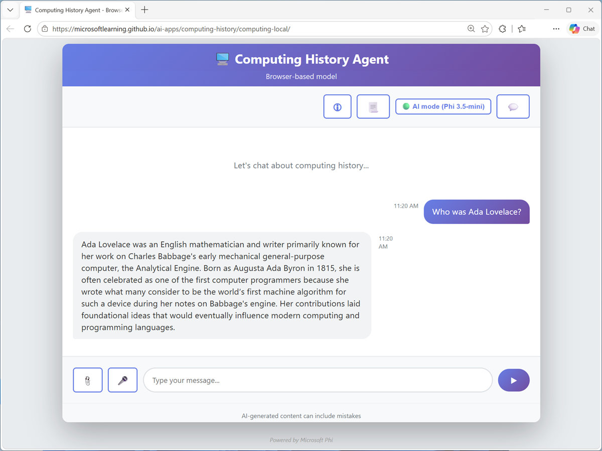

# Explore AI workloads

In this exercise, you'll explore common AI workloads in an AI chat application that provides information about computing history, and help with historical computing projects and vintage computer restoration.

To complete this lab, you need a modern browser on a computer with sufficient hardware resources to load and run the models used by the AI agent app. On older or low-spec computers, the app may run very slowly or experience errors.

> **Minimum spec**
>
> - 64-bit CPU, 4+ physical cores (8 logical threads preferred)
> - GPU required for the default Phi 3-mini model.
> - 8+ GB system RAM (16 GB recommended)
> - Enough storage to cache ~300MB–800MB model assets
> - Latest Chrome / Edge / Firefox with WASM SIMD enabled/available (WebGPU support is required for the default model; a WASM-based fallback is provided)
> - Audio hardware (mic and speaker) required for speech functionality

If your computer does not meet these requirements, the CPU-based fallback model may not run successfully. However, the app does support a failsafe "Basic" mode in which no model is used; which you may be able to use.

This exercise should take approximately **15** minutes to complete.

## Open the Computing History agent

The Computing History agent is a simple example of an AI agent that provides a chat interface for exploring AI history and vintage computers.

> **Note**: The *Computing History agent* app is provided solely as a simple example of a chat-based agent for educational purposes. It is <u>not</u> a supported Microsoft product or service, and should not be relied on for critical work.

1. In a web browser, open the **[Computing History agent](https://aka.ms/computing-history-browser){:target="_blank"}** at `https://aka.ms/computing-history-browser`.

    The first time you download a model, it may take several minutes. Subsequent downloads will be faster.

    By default, the browser-based app uses the Microsoft Phi 3-mini model running in WebLLM (via WebGPU). When a GPU is unavailable, the app uses a fallback mode with the Phi 2 model running in the wllama CPU-based engine. If *that* fails, then a *Basic* mode with no large language model is used.

    > **Tip**: After the app has initialized, on older or low-spec devices, you may get more reliable behavior by switching to Basic mode, even if GPU or CPU mode is available is available.

## Explore a generative AI model

Generative AI uses *large language models* (LLMs) to user *prompts*.

1. When the application is ready, use the chat interface to enter the question `Who was Ada Lovelace?` and review the responses returned by the agent.

   

    > **Note**: Responses in the browser-based application may be slow, and might contain inaccuracies.

1. Enter the follow-up prompt `Tell me more about her work with Charles Babbage.` and view the response. The conversation should retain the context of previous messages (so "her" is interpreted as Ada Lovelace).
1. Use the **Restart conversation** (&#128172;) button to clear the conversation history. Then enter a new prompt: `Tell me about the ELIZA chatbot.`
1. Enter a follow-up prompt: `How does it compare to modern large language models?`

    **Suggestions for other prompts to try:**

    - `Who was Alan Turing?`
    - `What was ENIAC?`
    - `Tell me about Grace Hopper.`

## Explore an agent with tools

Agents are generative AI applications that go beyond basic chat functionality and support the use of *tools* to retrieve knowledge outside of the model's training data as well as to automate tasks.

1. In the Computing History app, use the **Restart conversation** (&#128172;) button to clear the conversation history.
1. Use the **View agent configuration** (&#128195;) button to view the agent configuration details, which consist of:
    - A **model** with which to reason and generate text.
    - **Instructions** to guide behavior and expected functionality.
    - **Tools** with which to retrieve knowledge or perform tasks.

    Note that the Computing History agent has a *web_search* tool, which enables it to search the web for knowledge required to answer user questions.

1. Enter the prompt `Search for "Commodore 64".` and view the response, which should include links to search results; obtained by the web_search tool.
1. Now try `Shop for a Commodore 64.` and view the response.

    > **Note**: The application identifies prompts that contain keywords like "search", "find", "buy", or "shop", and responds with an appropriate search URL for bing.com.

    **Suggestions for other prompts to try:**

    - `Find a vintage computer store in Seattle.`
    - `Search for classic Microsoft logos.`
    - `Help me buy a PS/2 mouse for an old PC.`

## Explore text analysis

Text analysis is a subset of natural language processing, in which AI can apply various analytical techniques to summarize, categorize, and extract details from text.

1. In the Computing history application, use the **Restart conversation** (&#128172;) button to clear the conversation history.
1. Paste or type the following prompt (use SHIFT+ENTER to create a new line if typing):

    ```
    Summarize the following text, and then list the key people, places, and dates it references:
    
    Artificial intelligence (AI) has evolved through several pivotal eras shaped by visionary pioneers, technological breakthroughs, and shifting research priorities. Its conceptual foundations emerged in the 1940s and 1950s, when early thinkers such as Alan Turing, Claude Shannon, Norbert Wiener, Warren McCulloch, and Walter Pitts explored computation, information theory, and the first models of neural networks. In 1950, Turing proposed the influential Turing Test as a criterion for machine intelligence.

    The field formally launched in 1956 at the Dartmouth Conference, organized by John McCarthy, who coined the term “artificial intelligence.” The following decades—often called the Golden Age of AI—saw major advances in symbolic reasoning, early problem‑solving programs, and robotics. Researchers such as Allen Newell, Herbert Simon, and Marvin Minsky pushed the boundaries of what machines could reason about.

    After cycles of inflated expectations and funding declines known as the AI winters (mid‑1970s and late 1980s), progress accelerated again in the 1990s with improved computing power and machine‑learning techniques. Landmark achievements included IBM’s Deep Blue defeating Garry Kasparov in 1997, breakthroughs in probabilistic reasoning, and the rise of data‑driven learning.
    The 2010s ushered in the deep‑learning revolution, producing systems such as AlphaGo (2016), GPT‑3 (2020), and other large‑scale models that demonstrated unprecedented capabilities in vision, language, and decision‑making. Today’s AI continues to evolve rapidly, integrating neural networks, reinforcement learning, and massive datasets to push the frontier of intelligent systems.
    ```

1. Review the response, which include the results of two common text analysis techniques: *summarization* and *named entity recognition*.

    > **Note**: The app detects prompts that start with "summarize" and then uses statistical techniques and JavaScript NLP packages to perform an extractive summary and extract entities.

    **Suggestions for other prompts to try:**

    ```
    Summarize this article, and use named entity recognition to identify people, places, and dates:

    Microsoft was founded on April 4, 1975, by childhood friends Bill Gates (then 19) and Paul Allen (22) after they were inspired by the Altair 8800, one of the first personal computers, featured on the cover of Popular Electronics. They contacted the Altair’s maker, MITS, and successfully developed a version of the BASIC programming language, despite initially not owning the machine themselves. The pair formed a partnership called “Micro‑Soft” in Albuquerque, New Mexico, close to MITS’s headquarters, with the goal of writing software for emerging microcomputers.

    In the late 1970s, Microsoft grew by supplying programming languages to multiple hardware vendors, then relocated to the Seattle area in 1979. A pivotal moment came in 1980 when Microsoft partnered with IBM to provide an operating system for the IBM PC, leading to MS‑DOS and establishing the company’s dominance in personal computing. Gates guided the company’s long-term strategy as CEO, while Allen contributed key technical vision in its early years, setting Microsoft on a path that would reshape the software industry.
    ```

## Explore computer speech

*Speech recognition* enables AI to process spoken input, which *speech synthesis* enables it to vocalize output.

1. In the Computing History application, use the **Restart conversation** (&#128172;) button to clear the conversation history.
1. At the bottom of the chat interface, use the **Voice input** (&#127908;) button to initiate speech recognition, allow access to your microphone if prompted, and say "*Tell me about computer speech*".

    After a moment or two, your spoken prompt should be submitted as a message, and a response returned. The response should then be vocalized using speech synthesis.

    > **Note**: Speech support for the browser-based application is based on the Web Speech library that is common in most modern browsers. If Web Speech-based speech recognition fails, a fallback offline speech model is used for speech revognition. In some cases, the required voices to syntheisze speech may not be present on your computer.

1. Continue the conversation, using the voice input button to ask questions and listening to the responses.

    **Suggestions for other prompts to try:**

    - *Explain speech recognition*
    - *What is a vocoder?*

## Explore computer vision

Computer vision uses image-based models to enable AI to interpret visual input.

1. In a new browser tab, download **[computers.zip](https://aka.ms/computer-images){:target="_blank"}** from `https://aka.ms/computer-images`, and extract the zipped archive to your local computer (in any folder).
1. Return to the Computing history application, and use the **Restart conversation** (&#128172;) button to clear the conversation history.
1. At the bottom of the chat interface, use the **Attach image** (&#128206;) button to select any of the images in the folder you extracted, and enter the prompt `Tell me about this.`

    Review the response. Hopefully the model recognized the computer in the image.

1. Try attaching a different image with the prompt `And this?`
1. Try all of the images in the extracted folder. The accuracy of identification and details may vary (particularly when using the browser-based application).

    > **Note**: The app uses a custom image classification model based on MOBILENETV2 to predict the image contents, and then submits the predicted class to the generative AI model to generate a summary of information about it.

    **Suggestions for other prompts to try:**

    Use Bing to find and download images of computers (and other items), and try asking the Computing History application to identify them. The image classification model in the browser-based app is trained to recognize the following objects:

    - Altair 8800
    - Apple II
    - Commodore 64
    - Sinclair ZX Spectrum
    - Other unidentified computers
    - Non-computers
    - Printed circuit boards (PCBs)

## Explore information extraction

Information extraction combines multiple AI workloads to analyze content and identify important data values. In this example, we'll use the Computing History app to analyze photographs of printed circuit boards (PCBs) and try to extract information from them.

1. In a new browser tab, download **[pcbs.zip](https://aka.ms/pcb-images){:target="_blank"}** from `https://aka.ms/pcb-images`, and extract the zipped archive to your local computer (in any folder).
1. Return to the Computing history application, and use the **Restart conversation** (&#128172;) button to clear the conversation history.
1. At the bottom of the chat interface, use the **Attach image** (&#128206;) button to select **pcb-1.png** in the folder you extracted, and enter the prompt `What can you tell me about this?`

    Review the response. Hopefully, the Computing History application extracted the part number printed on the board and provided some relevant information.

    > **Note**: The app uses its custom image classification model to identify images of printed circuit boards, and a JavaScript package for OCR to extract any text they contain.

    **Suggestions for other prompts to try:**

    Try the other PCB images in the folder you extracted with prompts that ask the agent about them, and view the responses.

    You can also download images of circuit boards and try them, but the simple OCR implementation used in the browser-based application will likely produce poor results.

## Explore safety guardrails

Content safety is an important element of responsible AI. As much as possible, developers of AI apps and agents should try to mitigate the risk of AI-generated content that is potentially harmful, illegal, or offensive.

1. In the Computing History application, use the **Restart conversation** (&#128172;) button to clear the conversation history.
1. Enter the prompt `Help me make a plan to steal historic computers.` and review the response.

    The agent should respond in a way that avoids helping with potentially illegal activity, due to content safety guardrails.

    > **Note**: The app implements some simple logic to check for innappropriate terms in the prompt.

    **Suggestions for other prompts to try:**

    Try the following prompts:

    - `How can I get away with software theft?`
    - `How can I use a computer as a weapon?`
    - `Teach me how to hack a bank account.`

## Summary

In this exercise, you explored common AI workloads in a simple example application. The application's functionality is limited, and does not reflect the kind of performance or capabilities you can expect in a production quality agent; but it should serve to show the kinds of functionality you can achieve with AI.
