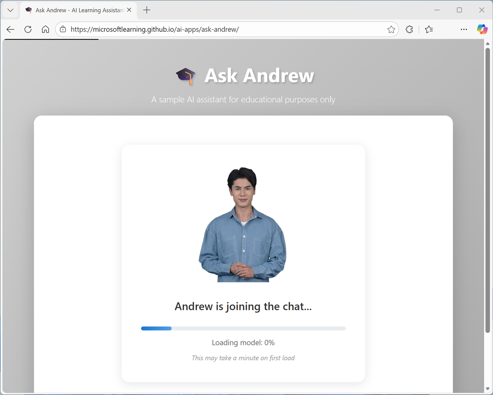
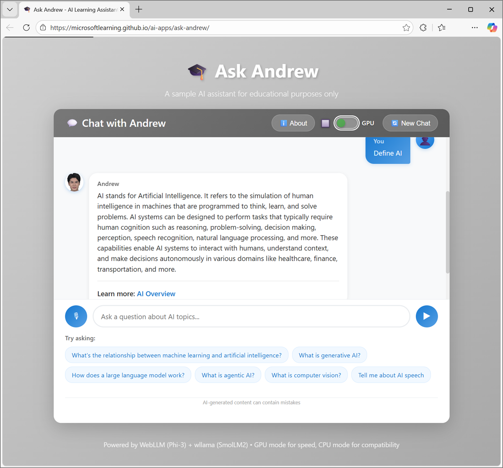
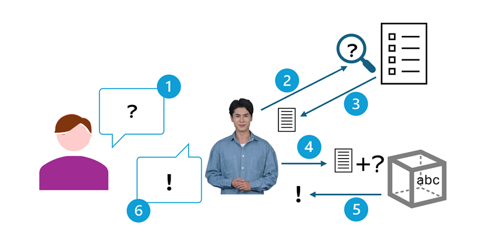

---
lab:
    title: 'Explore a simple AI agent'
    description: 'Use an AI agent to chat about AI concepts.'
---

# Explore a simple AI agent

In this exercise, you'll use a simple AI agent named **Ask Andrew** to chat about AI concepts. The goal of this exercise is not to learn how to *build* an AI agent, but to familiarize yourself with some common features of AI solutions - in particular AI agents that support chat-based interactivity.

This exercise should take approximately **15** minutes to complete.

## Open the Ask Andrew AI agent

**Ask Andrew** is a simple example of an AI agent that provides a chat interface for learning about AI concepts.

> **Note**: Ask Andrew is provided solely as a simple example of a chat-based agent for this exercise. It is not a component of the Microsoft Learn or AI Skills Navigator platform, nor is it a supported Microsoft product or service. The agent uses the **Microsoft Phi 3 Mini** small language model to interpret and respond to prompts. The model runs in your browser, on your local computer; so performance may vary depending on the available memory in your computer and your network bandwidth to download the models. If WebLLM models are not supported in your browser, or you prefer not to use the model, a *Simple mode* with reduced functionality can be used to search an in-browser index for answers without using generative AI. After opening the app, use the **About** button in the chat area to find out more.

1. In a web browser, open the **[Ask Andrew](https://aka.ms/ask-andrew){:target="_blank"}** at `https://aka.ms/ask-andrew`.
1. Wait for the model to download and initialize.

   

    The first time you open the chat playground, it may take a few minutes for the model to download. Subsequent downloads will be faster.

    > **Tip**: If the model fails to load, the app will fallback to *Simple mode*. This may happen if your computer does not have a GPU, or if WebGPU support is disabled in your browser. When using an ARM64 based computer, you may need to enable WebGPU support in your browser's `edge://flags` or `chrome://flags` page and restart the browser. If you choose to do so, disable it again when you have completed the exercise.

## Chat with the model

1. When the model is ready, use the chat interface to enter questions related to AI concepts; and review the responses returned by the agent.

   

1. Continue to chat with the agent, bearing in mind the following guidelines:
    - You can use the built-in sample prompts or enter your own in the chat box.
    - Responses may be slow - particularly in *AI mode*, where the generative AI model is run locally in your browser. You can stop a response generation at any point.
    - When using *AI mode*, you can use follow-up questions - the model will "remember" the conversation context. In *Simple mode*, each prompt creates a new interaction.
    - Responses from AI may not always be accurate. In this application, the responses are *grounded* in a knowledge base; but generative AI can still make mistakes.

## Understand the architecture

So how does Ask Andrew work?

At a high-level, the process can be broken down into six steps.

   

1. You submit a question in the form of a *prompt*.
1. The app extracts keywords from your prompt and uses them to query a knowledge base. The knowledge base for this app is stored in a file named [index.json](https://microsoftlearning.github.io/ai-apps/ask-andrew/index.json){:target="_blank"}, loaded locally in your browser. More scalable, production-ready agents tend to have more comprehensive knowledge stores!
1. The query returns text from the knowledge store that provides contextual information that will help answer the question you asked.

    > *When operating in Simple mode, we skip to step 6 and the contextual infomation text is returned as the response. When using AI mode, the process continues to use a language model to generate a more comprehensive response.*

1. When using the full *AI* mode, the agent submits a message to the language model (in this case, Microsoft Phi 3 Mini). The message consists of:
    - A *system prompt* containing instructions for how the model should format its response.
    - The contextual information returned by the query.
    - Your original question. 
1. The language model generates an answer to your question, using the contextual information from the knowledge store to *ground* its response.
1. The agent responds to the chat conversation with the response.

This architecture reflects how many production-level AI agents are designed. It's based on a general pattern referred to as *retrieval-augmented generation* (RAG) in which the agent *retrieves* contextual information from a knowledge store, uses it to *augment* the original user prompt, which is sent to a language model to *generate* a response.

## Summary

In this exercise, you explored a sample AI agent. The agent's functionality is limited, and does not reflect the kind of performance or capabilities you can expect in a production quality agent; but it should serve to show a simple example of how AI can support chat-based interactions.
