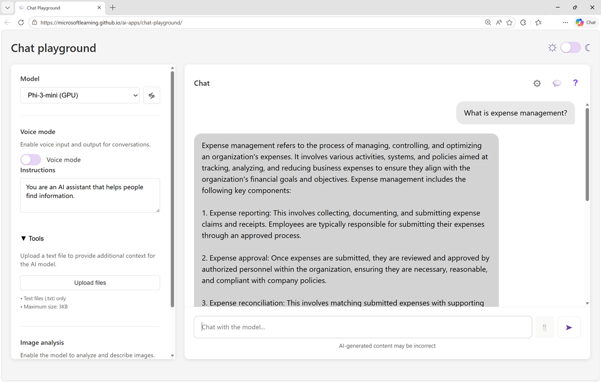

---
lab:
    title: 'Explore generative AI'
    description: 'Use a chat playground to interact with a generative AI model'
---

# Explore generative AI

In this exercise, you'll use a chat playground to interact with a generative AI model. You'll explore the effect of system prompts, model parameters, and grounding the model with data.

This exercise should take approximately **15** minutes to complete.

## Chat with a model

Let's start by using a chat interface to submit prompts to a generative AI model. In this exercise, we'll use the **Microsoft Phi 3 Mini model**; a small language model that is useful for general chat solutions in low bandwidth scenarios.

> **Note**: The model will run in your browser, on your local computer. Performance may vary depending on the available memory in your computer and your network bandwidth to download the model. 

1. In a web browser, open the **[Chat Playground](https://aka.ms/chat-playground){:target="_blank"}** at `https://aka.ms/chat-playground`.
1. Wait for the model to download and initialize.

    > **Tip**: The first time you open the chat playground, it may take a few minutes for the model to download. Subsequent downloads will be faster.

1. When the model is ready, enter a prompt such as `What is the capital of Scotland?`, and review the response.

    

1. Enter a follow-up prompt, such as `List 5 things I should do there.` and review the response; noting that the context of the conversation is "remembered" (the AI assistant "knows" you're asking about things to do in *Edinburgh* for example).
1. At the top of the chat pane, use the **Clear chat** (&#128465;) button to restart the conversation.
1. Try you're follow-up prompt again - this time, the conversational context has been reset; so the response may not be relevant to the previous messages (or indeed, make much sense).

## Experiment with system prompts

A system prompt is used to provide the model with an overall context for its responses. You can use the system prompt to provide guidelines about format, style, and constraints about what the model should and should not include in its responses.

1. In the **Setup** pane, in the **Give the model instructions and context** text area, change the system prompt to `You are an enthusiastic cartoon dog, eager to please and excited to chat. Start and end responses with "Woof!"`
1. Apply the changes - the conversation is automatically restarted.
1. Now try a prompt like `Tell me about London.` and review the output.
1. Change the system prompt to `You are an efficient assistant who responds concisely, with short and to the point answers.`
1. Apply the changes and try the same prompt as before (for example, `Tell me about London.`); and compare the response.
1. Change the system prompt back to `You are an AI assistant that helps people find information.` and apply the changes.

## Experiment with model parameters

Model parameters control how the model works, and can be useful for restricting the size of its responses (measured in *tokens*) and controlling how "creative" its responses can be.

1. In the **Setup** pane, expand the **Parameters** section.
1. Review the parameter settings; then, without changing them, enter a prompt like `What can I do in New York City?` and review the response
1. Experiment by changing the parameter values and repeating the same prompt. You should see some differences in behavior from the model. For example, increasing the **Temperature** adds more randomness into the model's word selection, increasing the "creativity" of the responses (to the point that they may end up being complete gibberish!)
1. When you've finished experimenting, reset the parameters to their default values and hide the **Parameters** area.

## Ground responses with data

Generative AI is the foundation for *agentic* solutions; in which AI agents can assist you and act on your behalf. Agents are more than general purpose chat apps. They usually have a particular focus, and use knowledge and tools to perform their duties.

For example, let's suppose an organization wants to use a generative AI agent to help employees with expense claims.

1. Change the system prompt to `You are a helpful AI assistant who supports employees with expense claims.` and apply the changes.
1. Enter an expenses-related prompt, such as `What can I spend on a taxi?` and view the response.

    The response is likely to be generic. Accurate; but not particularly helpful to the employee. We need to give the agent some knowledge about the company's expense policies and procedures.

1. Open a new browser tab, and view the **[expenses guide](https://aka.ms/expenses-txt){:target="_blank"}** at `https://aka.ms/expenses-txt`. We'll use this to ground the model, so it has some context for questions about expenses.

    > **Note**: This is a very small document for the purposes of this exercise. In a real scenario, an AI agent might have access to large volumes of data; usually in the form of a *vector index*.

1. Save the **expenses.txt** file on your local computer.
1. Return to the tab containing the what playground, and in the **Setup** pane, expand the **Add your data** section.
1. Add the **expenses.txt** document as a data source. The chat is automatically restarted.
1. Enter the same expenses-related prompt (for example, `What can I spend on a taxi?`) and view the response.

    This time the response should be informed by the information in the expenses data source.

1. Try a few more expenses-related prompts, like `Can I claim the cost of my dinner?`

## Summary

in this exercise, you explored a generative Ai model in a chat playground. You've seen how a model's responses can be affected by changing the system prompt, configuring model parameters, and by adding data.

The interface and techniques used in this exercise are similar to those in Azure AI Foundry portal; a tool for building AI agents on the Microsoft Azure AI Foundry platform.
