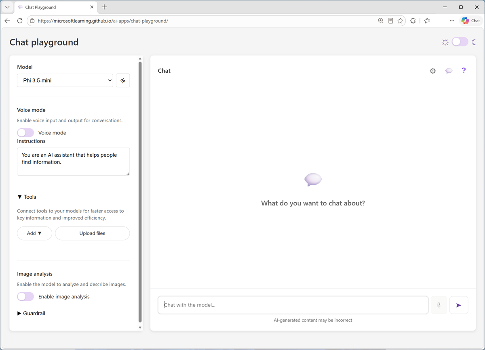
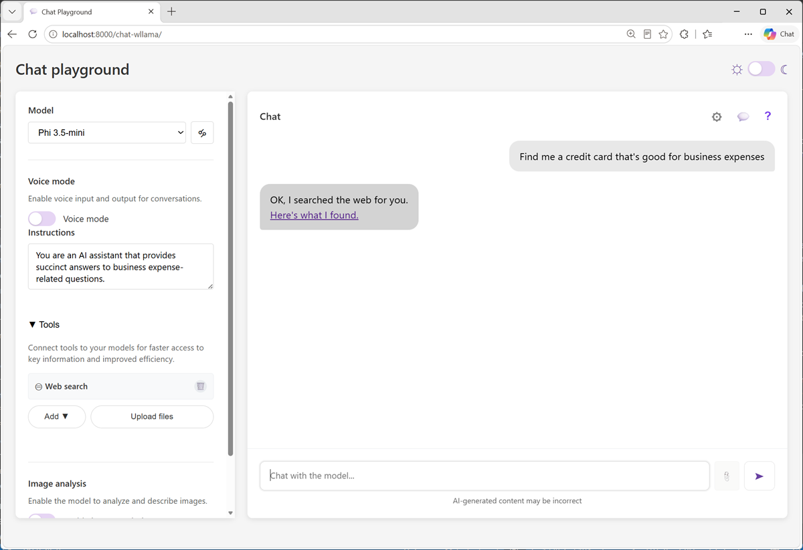
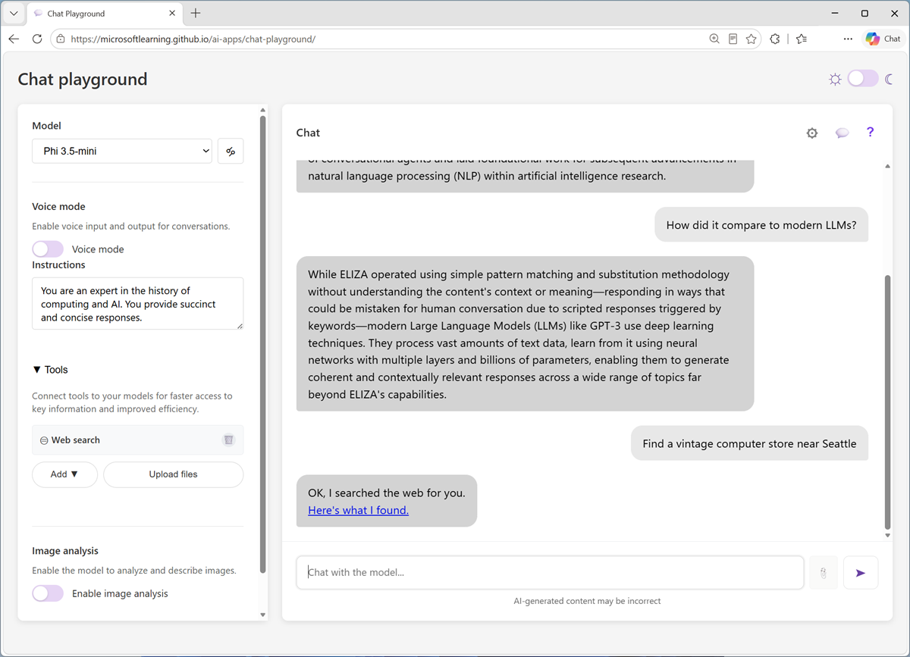
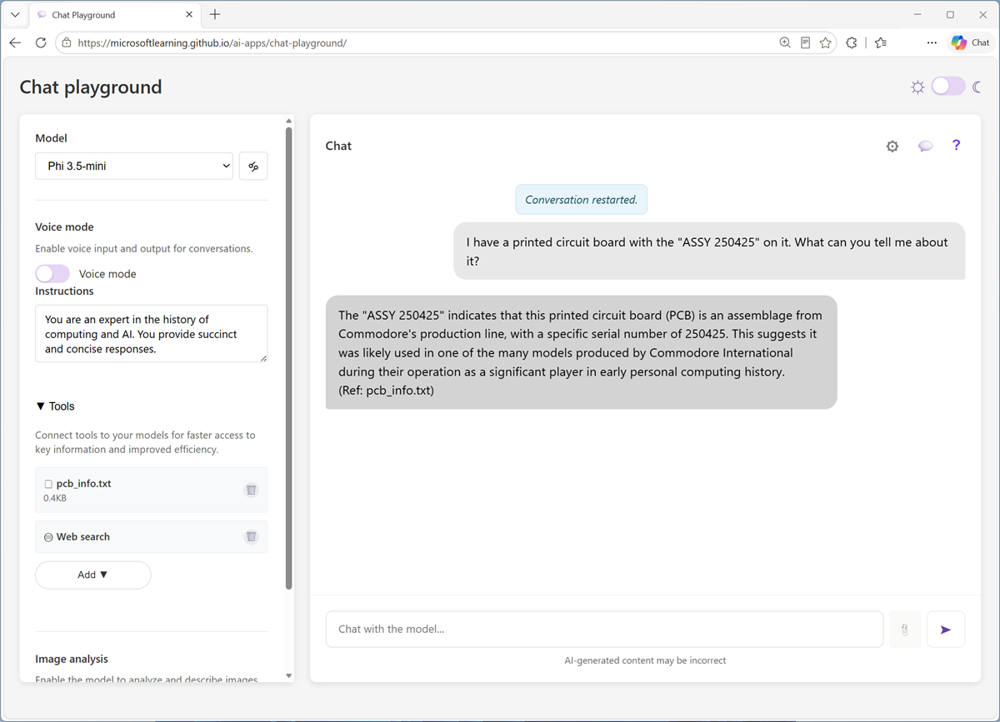
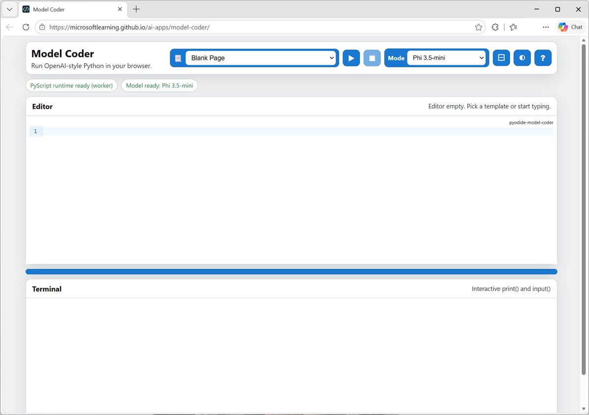
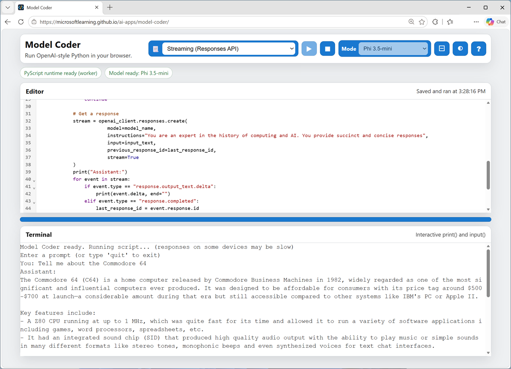

---
lab:
  title: Explore generative AI and agents
  description: Use a chat playground to interact with a generative AI model
  duration: 15
  level: 100
  islab: true
---

# Explore generative AI and agents

In this exercise, you'll use a chat playground to interact with a generative AI model, and explore how it could be used to support computing history agent that finds information about important figures, events, and technology in the history of computers.

> <br/>**Hi, I'm Anton.**<br/>I'll be here to help you with hints and tips as you work through this lab. You can also find me in the ***[Ask Anton](https://aka.ms/ask-anton){:target="_blank"}*** app; which runs an agent with generative AI model in your browser, with a *Basic* mode option for older or lower-spec computers.<br/><br/>*Ask Anton is not a supported Microsoft product or a component of Microsoft Learn or AI Skills Navigator. Just an experimental AI agent for you to explore as you learn about AI.*

To complete this exercise, you need a modern browser on a computer with sufficient hardware resources to load and run the models used by the *Chat Playground* and *Model Coder* apps. On older or low-spec computers, the apps may run very slowly or experience errors.

> **Minimum spec**<br/>If your computer does not meet these requirements, the AI model may not run successfully. However, the app does support a failsafe *Basic* mode in which no model is used; which provides simpler, but faster responses.<br/>
>
> - 64-bit CPU, 8 cores
> - GPU (recommended)
> - 8+ GB system RAM (16 GB recommended)
> - Enough storage to cache ~300MB–800MB model assets
> - Latest Chrome / Edge / Firefox with WASM SIMD enabled/available (WebGPU support is recommended; a WASM-based fallback is provided)
> - Audio hardware (mic and speaker) required for speech functionality

This exercise should take approximately **15** minutes to complete.

## Chat with a model

Let's start by using a chat interface to submit prompts to a generative AI model. In this exercise, we'll use a small language model that is useful for chat solutions in constrained hardware scenarios.

> **Note**: If your browser supports WebGPU, the chat playground uses the *Microsoft Phi 3.5 Mini* model running on your computer's GPU. If not, the model runs on CPU - with reduced response-generation quality. If *that* fails, a basic mode with no model and responses retrieved from Wikipedia is activated. Performance may vary depending on the available memory in your computer and your network bandwidth to download the model. After opening the app, use the **?** (*About this app*) icon in the chat area to find out more.

1. In a web browser, open the **[Chat Playground](https://aka.ms/chat-playground){:target="_blank"}** at `https://aka.ms/chat-playground`.
1. Wait for the model to download and initialize.

    The first time you download a model, it may take a few minutes. Subsequent downloads will be faster.

    > <br>**Tip**: If the model is taking a *very* long time to load, you can cancel and start in ***Basic*** mode. You can switch between available models at any time in the **Model** list; but on older or lower-spec computers, you may have a better experience in basic mode.

    When ready, the Chat Playground looks like this:

    

    > <br>**Tip**: You can switch between *light* and *dark* themes using the &#x263C; / &#x263E; toggle at the top right.

1. When the model is ready, enter the prompt `Who was Ada Lovelace?`, and review the response (which may take some time to be generated).

    

1. Enter a follow-up prompt, such as `Tell me more about her work with Charles Babbage.` and review the response.

    Generative AI chat applications often include chat history in the prompt; so the context of the conversation is retained between messages (for example, in the follow-up prompt `Tell me more about her work with Charles Babbage.`, "her" is interpreted as referring to Ada Lovelace)

    > **Note**: In *Basic* mode, the conversation history is not retained; so the follow up prompt results in a new Wikipedia query based on the keywords "Charles Babbage".

## Specify *instructions*

To support specific use cases and behaviors, you should use *instructions* (often referred to as a *system prompt*) to guide the model to generate appropriate responses. You can use instructions to give the model a specific focus or role, and provide guidelines about format, style, and constraints about what the model should and should not include in its responses.

1. In the model playground, at the top-right of the chat pane, use the **New chat** (💬) button to restart the conversation and remove the conversation history.
1. In the pane on the left, in the **Instructions** text area, change the system prompt to:

    ```
   You are an expert in the history of computing and AI. You provide succinct and concise responses.
    ```

1. Now enter a new user prompt related to computing history, such as `What can you tell me about ELIZA?`

    Review the response, which should provide some relevant information.

1. Ask the follow-up question `How did it compare to modern LLMs?`

## Add a web search tool

So far, the model has answered questions based on the data with which it was trained. While this is useful, that leaves out a lot of current information on the web; which might help the model give more relevant answers.

We can use *tools* to give models access to external data sources, and to perform custom tasks. Let's add a tool that enables the model to search the Web for up-to-date information.

1. In the pane on the left, under the instructions, expand the **Tools** section if it is not already expanded.
1. In the **Add** drop-down list, select **Web search** (<u>not</u> *File_search*).
1. After adding the *Web search* tool, in the chat pane, enter the prompt `Find a vintage computer store near Seattle` (*or your local city!*) and review the response.

    The model should have searched the Web for vintage computer stores near the specific city.

    

## Add knowledge

The combination of the model's training data and a tool to search the web can often be enough to support a comprehensive, general-purpose chat agent. However, often an agent needs to work in the context of a particular business or scenario, in which there is specialized or proprietary information that it needs to reason over when responding.

In this exercise, we'll give the model a *file search* tool with access to information about common manufacturer serial numbers that might be found on the printed circuit boards (PCBs) of vintage computers.

1. Open a new browser tab, and view the **[PCB Info](https://aka.ms/pcb_info){:target="_blank"}** file at `https://aka.ms/pcb_info`. We'll use this to ground the model, so it has some context for questions about serial numbers printed on PCBs.

    > <br>**Note**: This is a very small document for the purposes of this exercise. In a real scenario, an AI agent might have access to large volumes of data; usually in the form of a *vector index*. In an enterprise solution, access to multiple sources of knowledge can be centralized through *Foundry IQ* - a tool in Microsoft Foundry built on *Azure AI Search*.  

1. Save the **pcb_info.txt** file on your local computer.
1. Return to the tab containing the chat playground, and in the pane on the left, in the **Tools** section, add the **File search** tool (or select **Upload files**).
1. Upload the **pcb_info.txt** file. The chat is automatically restarted.
1. Enter the prompt `I have a printed circuit board with the "ASSY 250425" on it. What can you tell me about it?` and view the response.

    This time the response should be informed by the information in the file.

    

1. Try a few more prompts - for example, `What kind of computer does a PCB with "820-001A" come from?` or `What about "i386"?`.

    When there's relevant information in the file, the model will use it to answer. If no information is found, the model will use its own training knowledge.

    > **Note**: The small amount of data and the limited capabilities of the small models used in this exercise may result in some inaccurate or incomplete responses; but the principle of *retrieving* contextual information, using it to *augment* the prompt, and *generating* responses based on the data is a common pattern in generative AI apps and agents known as *Retrieval Augmented Generation* (or *RAG*).

## Explore client code

You've seen how a model can be used in a pre-provided chat playground, but how do developers build apps and agents that submit prompts to models and process responses?

One of the most commonly used application programming interfaces (APIs) used to develop apps that work with LLMs is the OpenAI API - and in particular the Python SDK for the OpenAI API.

1. Navigate away from the Chat Playground app to the **[Model Coder](https://aka.ms/model-coder){:target="_blank"}** app at `https://aka.ms/model-coder` and wait for the Python environment and model to load.

    As with the chat playground, the first time the model is loaded it may take a minute or so.

    > <br>**Tip**: If the model is taking a long time to load, you can cancel and start in basic mode. You can switch between available models at any time in the **Mode** list.

    

    > <br>**Tip**: You can switch between *light* and *dark* themes using the &#9681; icon at the top right.

    This app provides an in-browser sandbox with a Python library that encapsulates the most common classes in the OpenAI SDK. You'll use it to write and run real Python code that submits prompts to a local LLM running in the browser.

1. When the model has loaded, select the **Streaming (Responses API)** template, and view the code in the **Editor** pane.

   The Model Coder app includes multiple examples of submitting prompts to a generative AI model. The *Streaming (Responses API)* example maintains conversation history and uses a *streaming* interface to maximize resposiveness by displaying partial responses as they're received from the model.

1. Edit the code to change the **instructions** for the model to the same computing history related one you used in the chat playground (`You are an expert in the history of computing and AI. You provide succinct and concise responses`), as shown here:

    ```python
   # import namespace
   from openai import OpenAI
    
   def main():
    
        try:
            # Configuration settings 
            endpoint = "https://local/openai"
            key = "key123"
            model_name = "phi"
    
            # Initialize the OpenAI client
            openai_client = OpenAI(
                base_url=endpoint,
                api_key=key
            )
            
            # Track responses
            last_response_id = None
            print("Enter a prompt (or type 'quit' to exit)")
            while True:
                input_text = input('You: ')
                if input_text.lower() == "quit":
                    print("Goodbye!")
                    break
                if len(input_text) == 0:
                    print("Please enter a prompt:")
                    continue
    
                # Get a response
                stream = openai_client.responses.create(
                            model=model_name,
                            instructions="You are an expert in the history of computing and AI. You provide succinct and concise responses",
                            input=input_text,
                            previous_response_id=last_response_id,
                            stream=True
                )
                print("Assistant:")
                for event in stream:
                    if event.type == "response.output_text.delta":
                        print(event.delta, end="")
                    elif event.type == "response.completed":
                        last_response_id = event.response.id
                print()
                
    
        except Exception as ex:
            print(ex)
    
   if **name** == '**main**':
        main()
    ```

    This code uses the OpenAI *Responses* API, which is commonly used to submit prompts to models and agents.

1. Use the **&#9654;** (Run code) button on the toolbar to run the Python code.

    The code runs in the **Terminal** pane at the bottom of the screen (it may take a minute or so to run).

1. When prompted, enter questions about computing history and view the responses.

    Some suggested prompts to try:

    - `Tell me about the Commodore 64`
    - `What about the ZX Spectrum?`
    - `Who was Grace Hopper?`
    - `What was Alan Turing's contribution to AI?`

    

    > **Note**: The model used in this app is a small language model with limited training data and a small context window. Responses may not be accurate. However, the point of the exercise is to explore the OpenAI SDK syntax to submit prompts and receive responses.

    When you're finished, enter `quit`.

## Summary

In this exercise, you explored a generative AI model in a chat playground. You've seen how a model's responses can be affected by providing instructions, tools, and knowledge. Finally, you've explored how developers can build generative AI client apps and agents through OpenAI-compatible APIs in Python.

The interface and techniques used in this exercise are similar to those in Microsoft Foundry portal; a platform for building AI apps and agents in the Microsoft Azure cloud. You can use the OpenAI SDK to connect to Microsoft Foundry endpoints and work with your models and agents there.

> <br/>If you used the [*Ask Anton*](https://aka.ms/ask-anton){:target="_blank"} app during this lab, we'd love you to [tell us about your experience with it](https://forms.office.com/r/fC0ndfBQeK){:target="_blank"}!
