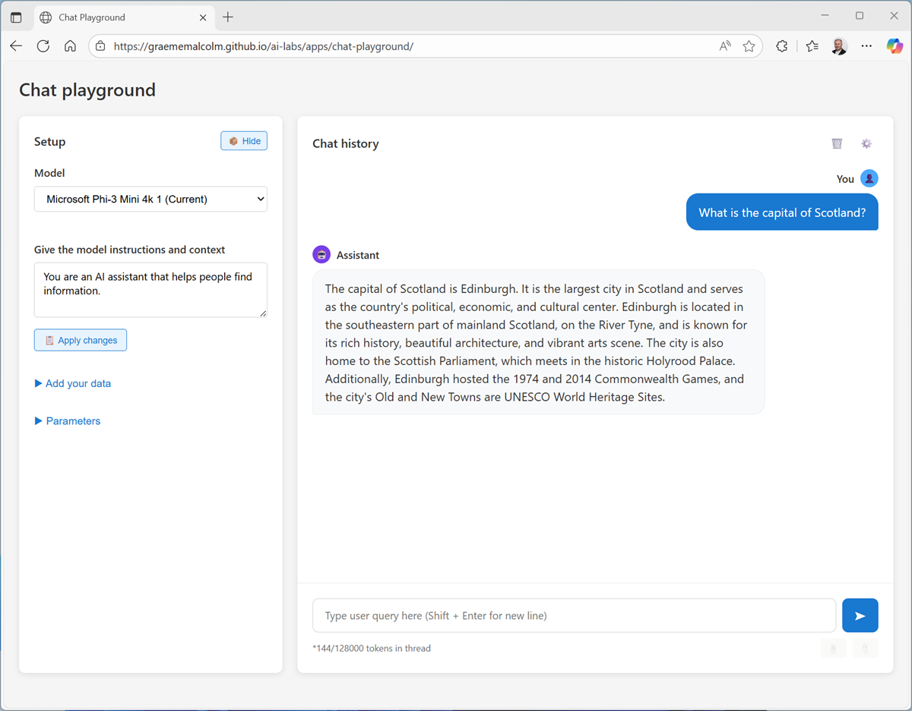

---
lab:
    title: 'Explore generative AI'
    description: 'Use a chat playground to interact with a generative AI model'
---

# Explore generative AI

In this exercise, you'll use a chat playground to interact with a generative AI model. The goal of this exercise is to explore the effect of system prompts, model parameters, and grounding models with data.

This exercise should take approximately **15** minutes to complete.

## Chat with a model

Let's start by using a chat interface to submit prompts to a generative AI model. In this exercise, we'll use a small language model that is useful for general chat solutions in low bandwidth scenarios.

> **Note**: If your browser supports WebGPU, the chat playground uses the *Microsoft Phi 3 Mini* model running on your computer's GPU. If not, the SmolLM2 model is used, running on CPU - with reduced response-generation quality. Performance for either model may vary depending on the available memory in your computer and your network bandwidth to download the model. After opening the app, use the **?** (*About this app*) icon in the chat area to find out more.

1. In a web browser, open the **[Chat Playground](https://aka.ms/chat-playground){:target="_blank"}** at `https://aka.ms/chat-playground`.
1. Wait for the model to download and initialize.

    > **Tip**: The first time you download a model, it may take a few minutes. Subsequent downloads will be faster.

1. When the model is ready, enter a prompt such as `Who was Ada Lovelace?`, and review the response (which may take some time to be generated).

    

1. Enter a follow-up prompt, such as `Tell me more about her work with Charles Babbage.` and review the response.

    > **Note**: Generative AI chat applications often include chat history in the prompt; so the context of the conversation is retained between messages (for example, in the follow-up prompt `Tell me more about her work with Charles Babbage.`, "her" is interpreted as relating to Ada Lovelace).

1. At the top of the chat pane, use the **New chat** (&#128172;) button to restart the conversation. This removes all conversation history.
1. Enter a new prompt, such as `Who was Alan Turing?` and view the response.
1. Continue the conversation with prompts such as `What is the Turing test?` or `What is a Turing machine?`.

## Experiment with system prompts

A system prompt is used to provide the model with an overall context for its responses. You can use the system prompt to provide guidelines about format, style, and constraints about what the model should and should not include in its responses.

1. At the top of the chat pane, use the **New chat** (&#128172;) button to restart the conversation. Then enter a new prompt, such as `What was ENIAC?` and view the response.
1. Start a new chat, and then in the pane on the left, in the **Instructions** text area, change the system prompt to `You are an AI assistant that helps people find information about computing history. IMPORTANT: You must answer concisely with a single paragraph.`
1. Now try the same prompt as before (`What was ENIAC?`) and review the output.
1. Continue to experiment with different system prompts to try to influence the kinds of response returned by the model.

    > **Note**: Smaller models like SmolLM2 can be less responsive to explicit system prompts than larger ones. You may observe some cases where the system instructions are not followed precisely.

1. When you have finished experimenting, change the system prompt back to `You are an AI assistant that helps people find information.`

## Experiment with model parameters

Model parameters control how the model works, and can be useful for restricting the size of its responses (measured in *tokens*) and controlling how "creative" its responses can be.

1. Use the **New chat** (&#128172;) button to restart the conversation.
1. In the pane on the left, next to the selected model, select **Parameters** (&#128880;).
1. Review the parameter settings; then, without changing them, enter a prompt like `Explain Moore's law.` and review the response
1. Experiment by changing the parameter values and repeating the same prompt. You should see some differences in behavior from the model. For example, changing the **Temperature** modifies the randomness of the model's word selection, changing the "creativity" of the responses (to the point that too high a temperature can cause nonsensical responses).

    > **Note**: Parameters changes can have less effect on smaller models.

1. When you've finished experimenting, reset the parameters to their default values.

## Ground responses with data

Generative AI is the foundation for *agentic* solutions; in which AI agents can assist you and act on your behalf. Agents are more than general purpose chat apps. They usually have a particular focus, and use knowledge and tools to perform their duties.

For example, let's suppose an organization wants to use a generative AI agent to help employees with expense claims.

1. Change the system prompt to `You are a helpful AI assistant who supports employees with expense claims.` and start a new chat conversation.
1. Enter the prompt `How do I submit a claim?` and view the response.

    The response is likely to be generic. Accurate; but not particularly helpful to the employee. We need to give the agent some knowledge about the company's expense policies and procedures.

1. Open a new browser tab, and view the **[expenses guide](https://aka.ms/expenses-txt){:target="_blank"}** at `https://aka.ms/expenses-txt`. We'll use this to ground the model, so it has some context for questions about expenses.

    > **Note**: This is a very small document for the purposes of this exercise. In a real scenario, an AI agent might have access to large volumes of data; usually in the form of a *vector index*.

1. Save the **expenses.txt** file on your local computer.
1. Return to the tab containing the chat playground, and in the pane on the left, expand the **Tools** section if it's not already expanded.
1. Upload the **expenses.txt** file. The chat is automatically restarted.
1. Enter the same expenses-related prompt (`How do I submit a claim?`) and view the response.

    This time the response should be informed by the information in the expenses data source.

1. Try a few more expenses-related prompts, like `How much can I spend on a taxi?`, `What about a hotel?` or `Can I claim the cost of my dinner?`

    **Note**: The small amount of data and the limited capabilities of the small models used in this exercise may result in some inaccurate responses; but the principle of *retrieving* contextual information, using it to *augment* the prompt, and *generating* responses based on the data is a common pattern in generative AI solutions known as *Retrieval Augmented Generation* (or *RAG*).

## Summary

In this exercise, you explored a generative AI model in a chat playground. You've seen how a model's responses can be affected by changing the system prompt, configuring model parameters, and by adding data.

The interface and techniques used in this exercise are similar to those in Microsoft Foundry portal; a platform for building AI apps and agents in the Microsoft Azure cloud.
