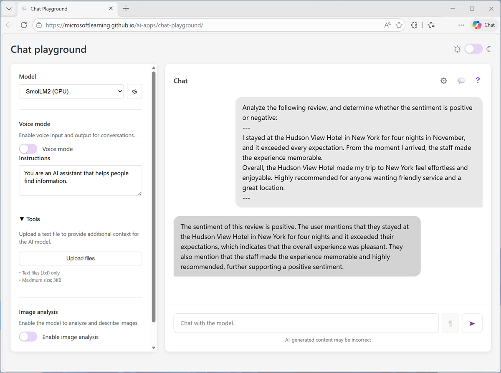
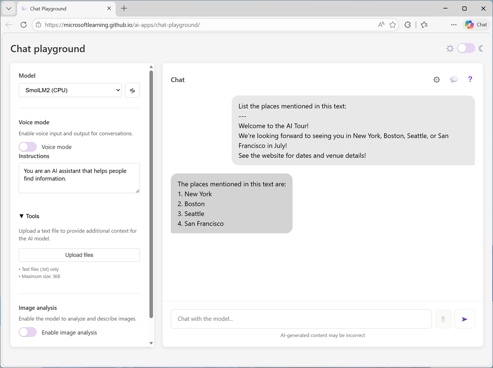
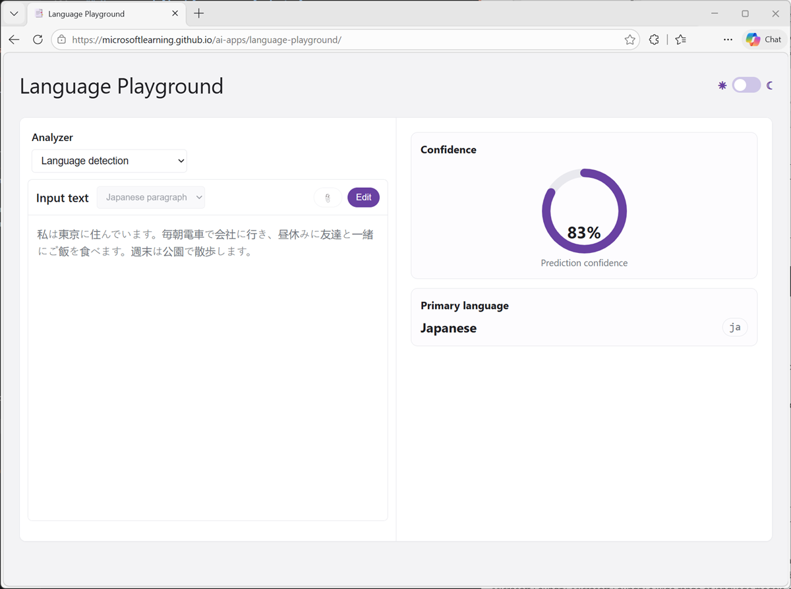

---
lab:
    title: 'Explore AI text analysis'
    description: 'Use AI to analyze text.'
---

# Explore text analytics

In this exercise, you'll use AI natural language processing functionality to analyze text.

This exercise should take approximately **15** minutes to complete.

## Prepare for text analysis

We'll use a browser-based application that's based on a simplified subset of the text analysis capabilities of the Microsoft Foundry language playground.

1. Download and extract **[text.zip](https://aka.ms/ai-text){:target="_blank"}** at `https://aka.ms/ai-text`. This archive contains multiple text documents that you'll use in this exercise.
1. In a web browser, open the **[Text Analyzer](https://aka.ms/text-analyzer){:target="_blank"}** at `https://aka.ms/text-analyzer`. This application provides the text analysis functionality you'll use.

## Analyze sentiment

Sentiment analysis is a common NLP task. It's used to determine whether text conveys a positive, neutral or negative sentiment; which makes it useful for categorizing reviews, social media posts, and other subjective documents.

> **Note**: The sentiment analysis functionality in the app is a simplified implementation of the [AFINN-165](https://github.com/fnielsen/afinn/blob/master/afinn/data/AFINN-en-165.txt) scoring technique, in which a set of words with scores between -5 (negative) and +5 (positive) are used to calculate an aggregate sentiment score for the text.

1. In the Text Analyzer app, ensure the **Analyze sentiment** tile is selected.
1. Upload **document-1.txt** from the folder where you extracted the downloaded text files.
1. Run the analysis and observe the resulting sentiment prediction.

    

1. Repeat the analysis for **document-2.txt** and **document-3.txt**.

    You can experiment further by uploading your own text files or by typing text into the Text Analyzer interface. The results may vary due to the simplified implementation of sentiment anslysis in this lightweight app.

## Extract key phrases

Key phrase extraction can be a useful first step in identifying the main topics in a document.

> **Note**: The key phrase extraction technique used in the app is based on statistical analysis techniques such as word frequency and parts-of-speech tagging.

1. In the Text Analyzer app, select the **Extract key phrases** tile.
1. Upload **document-1.txt** from the folder where you extracted the downloaded text files.
1. Run the analysis and observe the resulting key phrases.

    

1. Repeat the analysis for **document-2.txt** and **document-3.txt**.

    You can experiment further by uploading your own text files or by typing text into the Text Analyzer interface. Again, the results may vary.

## Extract named entities

Named entities are the people, places, dates, and other important items mentioned in text.

> **Note**: The named entity recognition technique used in the app is based on pattern matching and a dictionary of common entity types.

1. In the Text Analyzer app, select the **Extract named entities** tile.
1. Upload **document-1.txt** from the folder where you extracted the downloaded text files.
1. Run the analysis and observe the resulting named entities.

    

1. Repeat the analysis for **document-2.txt** and **document-3.txt**.

    You can experiment further by uploading your own text files or by typing text into the Text Analyzer interface.

## Summarize text

Summarization is a way to distill the main points in a document into a shorter amount of text.

> **Note**: The summarization technique used in the app is based on the TextRank algorithm.

1. In the Text Analyzer app, select the **Summarize text** tile.
1. Upload **document-1.txt** from the folder where you extracted the downloaded text files.
1. Run the analysis and observe the resulting summarization.

    

1. Repeat the analysis for **document-2.txt** and **document-3.txt**.

    You can experiment further by uploading your own text files or by typing text into the Text Analyzer interface.

## Summary

in this exercise, you explored the use of a AI to analyze text, using NLP functionality in a browser-based app.

While the statistical techniques in this exercise are sufficient to demonstrate the concepts, to perform high-quality language analytics at scale, you should use a cloud-based AI platform like Microsoft Foundry. Microsoft Foundry a wide range of language models, some of which are optimized for specific language processing tasks. Additionally, Azure Language in Microsoft Foundry tools offers a specialized service with APIs for common text analytics tasks.
