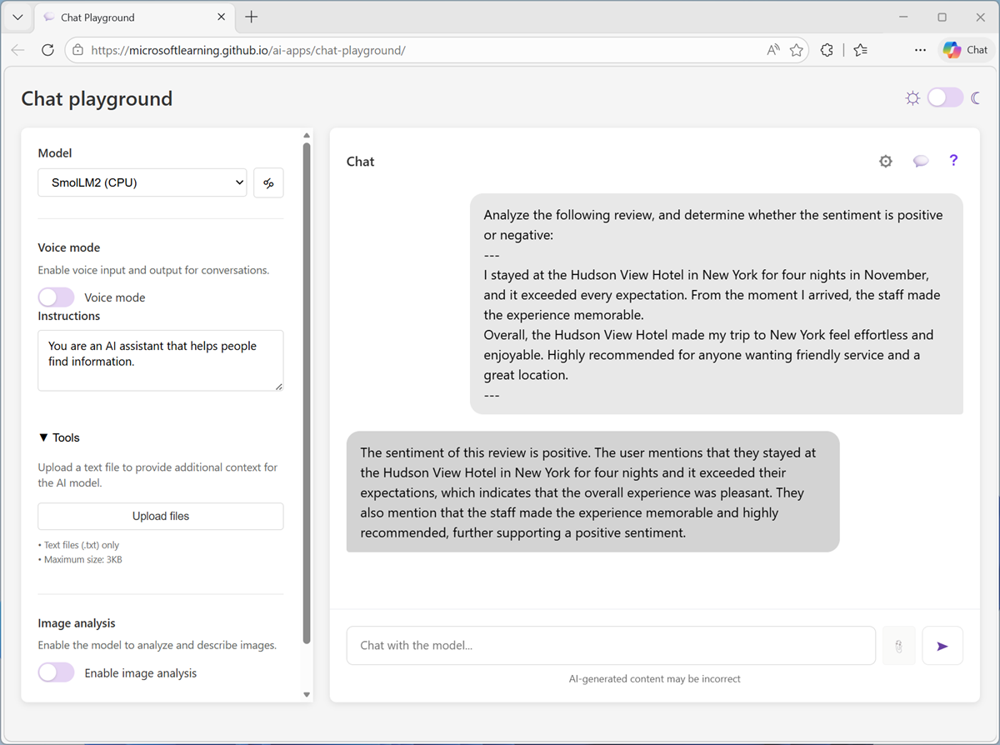
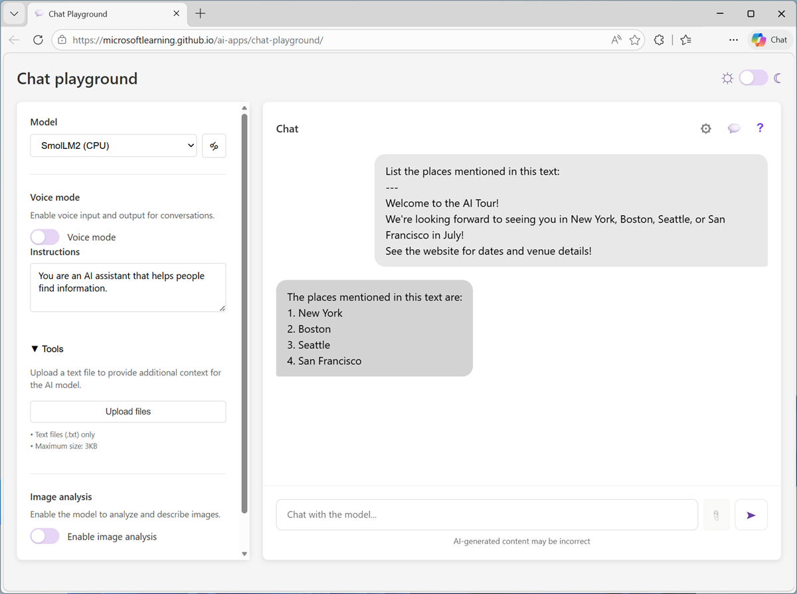
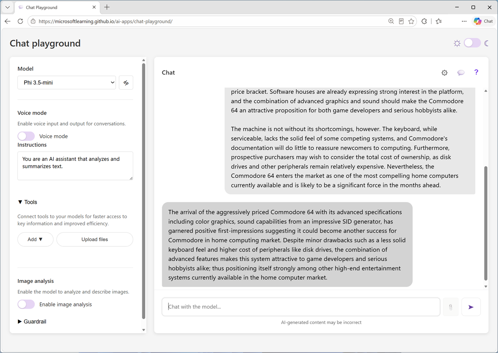
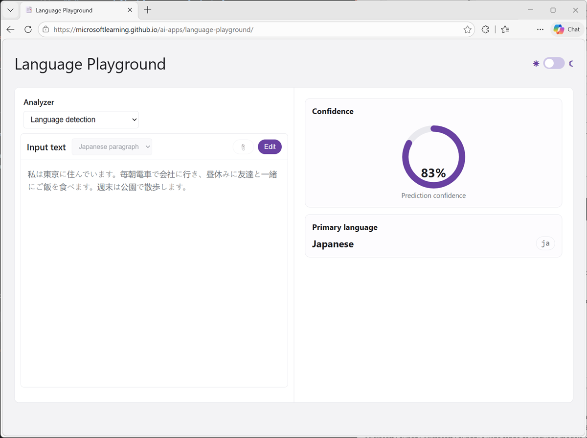
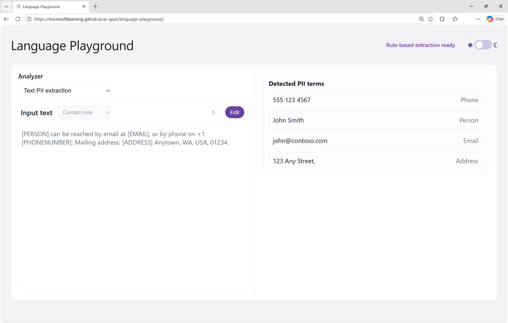

---
lab:
  title: Explore AI text analysis
  description: Use AI to analyze text.
  duration: 15
  level: 100
  islab: true
---

# Explore text analytics

In this exercise, you'll use AI natural language processing functionality to analyze text. The goal of this exercise is to explore common applications of text analysis techniques.

We'll use browser-based applications that are based on simplified implementations of the chat and language playgrounds in the Microsoft Foundry portal.

This exercise should take approximately **15** minutes to complete.

## Use a generative AI model to analyze text

Let's start by using a chat interface to submit prompts to a generative AI model to perform common text analysis tasks. In this exercise, we'll use a small language model that is useful for general chat solutions in low bandwidth scenarios.

> **Note**: If your browser supports WebGPU, the chat playground uses the *Microsoft Phi 3 Mini* model running on your computer's GPU. If not, the SmolLM2 model is used, running on CPU - with reduced response-generation quality. Performance for either model may vary depending on the available memory in your computer and your network bandwidth to download the model. On older or low-spec devices, you may get more reliable behavior by switching to the CPU-based model even if WebGPU is available. After opening the app, use the **?** (*About this app*) icon in the chat area to find out more.

1. In a web browser, open the **[Chat Playground](https://aka.ms/chat-playground){:target="_blank"}** at `https://aka.ms/chat-playground`.
1. Wait for the model to download and initialize.

    > **Tip**: The first time you download a model, it may take a few minutes. Subsequent downloads will be faster. If your browser or operating system does not support WebGPU models, the fallback CPU-based model will be selected (which provides slower performance and reduced quality of response generations).

### Analyze sentiment

Sentiment analysis is a common NLP task. It's used to determine whether text conveys a positive, neutral or negative sentiment; which makes it useful for categorizing reviews, social media posts, and other subjective documents.

1. In the chat playground, enter the following prompt (using SHIFT+ENTER for new lines if typing)

    ```
    Analyze the following review, and determine whether the sentiment is positive or negative:
    ---
    I stayed at the Hudson View Hotel in New York for four nights in November, and it exceeded every expectation. From the moment I arrived, the staff made the experience memorable.
    Overall, the Hudson View Hotel made my trip to New York feel effortless and enjoyable. Highly recommended for anyone wanting friendly service and a great location.
    ---
    ```

1. Review the response, which should include an analysis of the text's sentiment.

    

1. Enter the following prompt to analyze a different review:

    ```

    What about this one?
    ---
    I had a terrible stay at the Sunset Palms Hotel in September. Check‑in was slow, and most of the staff seemed overwhelmed and uninterested. Between the thin walls, unreliable Wi‑Fi, and general lack of cleanliness, I wouldn’t stay at Sunset Palms again.
    ---
    ```

    You can experiment further by creating your own prompts. The results may vary due to the small language model used in this lightweight app.

### Extract named entities

Named entities are the people, places, dates, and other important items mentioned in text.

1. At the top of the chat pane, use the **New chat** (&#128172;) button to restart the conversation. This removes all conversation history.
1. Enter the following prompt, and review the results:

    ```
    List the places mentioned in this text:
    ---
    Welcome to the AI Tour!
    We're looking forward to seeing you in New York, Boston, Seattle, or San Francisco in July!
    See the website for dates and venue details!
    ```

    The model should identify the specific places mentioned in the text.

    

### Summarize text

Summarization is a way to distill the main points in a document into a shorter amount of text.

1. At the top of the chat pane, use the **New chat** (&#128172;) button to restart the conversation. This removes all conversation history.
1. Enter the following prompt, and review the results:

    ```

    Summarize the following meeting transcript in a single paragraph
    ---
    Alex Chen: “We need an offsite location that’s easy to reach—Denver and Austin were my first thoughts.”
    Priya Nair: “Austin’s appealing, but I’m worried about hotel availability and overall cost.”
    Miguel Torres: “I checked a few options, and Las Vegas consistently comes out easier for flights and venues.”
    Alex Chen: “That’s true—Vegas also gives us more flexibility than Denver or San Diego.”
    Priya Nair: “San Diego would be nice, but when we compare logistics, Vegas clearly wins.”
    Miguel Torres: “Exactly—it’s simpler and more scalable than the other options.”
    Alex Chen: “Sounds like we’re aligned that Las Vegas is the best choice overall.”
    Priya Nair: “Yes, I’m comfortable choosing Vegas over the other locations.”
    Miguel Torres: “Agreed—let’s lock in Las Vegas for the offsite.”
    ```

    The model should generate a summary of the text.

    

## Use a specialized language analysis tool

While a large language model that's trained for general generative AI workloads can often do a great job of text analysis, sometimes a more specialized tool can be used by an agent to get more predictable results.

1. In your web browser, open the **[Language Playground](https://aka.ms/language-app){:target="_blank"}** at `https://aka.ms/language-app`.

> **Note**: The Language Playground app uses statistical text analysis techniques to perform two common NLP tasks: language detection and personally identifiable information (PII) redaction.

### Detect language

In scenarios where text could potentially be in one of multiple languages, the first step in an analysis workflow is often to determine the primary language so the text can be routed to the most appropriate model or agent for the subsequent processing.

1. In the Language Playground app, ensure that the **Language detection** analyzer is selected.
1. In the **Input text** list, select one of the provided sample documents. Then use the **Detect** button to detect the language in which the sample is written.

    

1. After reviewing the detected language details, use the **Edit** button to make the input text editable again. Now you can:
    - Select another sample.
    - Type your own text.
    - Upload a text file.

    For example, enter the following input text and detect the language it is written in:

    ```
    ¡Hola! Me llamo Josefina y vivo en Madrid, España. Soy doctora en un hospital, ¡lo que me mantiene muy ocupada!
    ```

1. Experiment with input of your own. The Language Playground app is designed to support detection of the following languages:

    - English
    - French
    - Spanish
    - Portuguese
    - German
    - Italian
    - Simplified Chinese
    - Japanese
    - Hindi
    - Arabic
    - Russian

    > **Tip**: You can use the [Bing Translator](https://www.bing.com/translator){:target="_blank"} at `https://www.bing.com/translator` to generate text in languages you don't speak!

### Identify PII in text

To comply with privacy policies and laws, organizations often need to detect and redact personally identifiable information (PII) such as names, addresses, phone numbers, email addresses, and other personal details.

1. In the Language Playground app, select the **Text PII extraction** analyzer.
1. In the **Input text** list, select one of the provided sample documents. Then use the **Detect** button to detect PII values in the text.

    

1. After reviewing the detected PII details, use the **Edit** button to make the input text editable again. Now you can:
    - Select another sample.
    - Type your own text.
    - Upload a text file.

    For example, enter the following input text and detect any PII it contains:

    ```
    Maria Garcia called from 020 7946 0958 and asked to send documents to 42 Market Road, London, UK, SW1A 1AA.
    ```

1. Experiment with input of your own. The Language Playground app is designed to support detection of the following types of PII:

    - People names
    - Email addresses
    - Phone numbers
    - Street addresses

    > **Note**: The Language Playground app uses a combination of statistical analysis and regular expression matching to detect potential PII fields. It's <u>not</u> designed as a production-level tool and is likely to detect false positives and fail to detect PII fields in some cases.

## Summary

In this exercise, you explored the use of a AI to analyze text, using NLP functionality in browser-based apps.

While the small models and statistical techniques in this exercise are sufficient to demonstrate the concepts, to perform high-quality language analytics at scale, you should use a cloud-based AI platform like Microsoft Foundry. Microsoft Foundry includes a wide range of generative AI models, many of which are extremely proficient at language processing tasks. Additionally, Azure Language in Microsoft Foundry tools offers a specialized service with APIs for common text analytics tasks.
