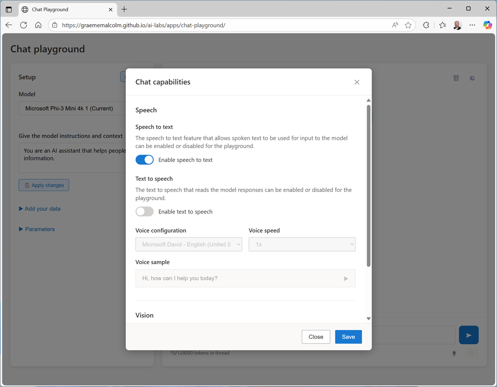
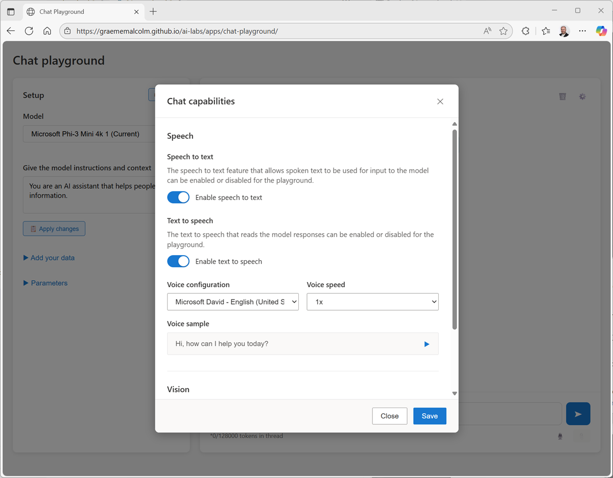

---
lab:
    title: 'Explore AI speech'
    description: 'Use AI to explore speech-to-text and text-to-speech capabilities with a generative AI model.'
---

# Explore AI speech

In this exercise, you'll interact with a generative AI model using speech. You'll explore speech-to-text (STT) and text-to-speech (TTS) functionality.

This exercise should take approximately **15** minutes to complete.

## Open the Speech Playground app

Let's start by chatting with a generative AI model. In this exercise, we'll use a browser-based application to chat with the **Microsoft Phi 3 Mini model**; a small language model that is useful for general chat solutions in low bandwidth scenarios. The app also uses Web Speech APIs for speech recognition and synthesis.

> **Note**: The model will run in your browser, on your local computer. Performance may vary depending on the available memory in your computer and your network bandwidth to download the model. If WebLLM models are not supported in your browser, a fallback mode with reduced functionality will be enabled. After opening the app, use the **?** (*About this app*) icon in the chat area to find out more.

1. In a web browser, open the **[Speech Playground](https://aka.ms/speech-playground){:target="_blank"}** at `https://aka.ms/speech-playground`.
1. Wait for the model to download and initialize.

    > **Tip**: The first time you open the app, it may take a few minutes for the model to download. Subsequent downloads will be faster. If your browser or operating system does not support WebLLM models, the fallback "None" model will be selected and responses will be generated by queries to Wikipedia.

1. View the Speech Playground app, which should look like this:

   

## Select a voice

Text-to-speech solutions use *voices* to control the cadence, pronunciation, timbre, and other aspects of generated speech. The available voices depend on your browser and operating system.

> **Note**: If no voices are available in your browser, the app will generate text responses only.

1. In the configuration pane on the left, view the voices in the **Voice** drop-down list.
1. Select any of the available voices, and use the *Preview selected voice* (**&#9655;**) button to hear a sample of the voice.
1. When you have selected the voice you want to use, use the **Apply changes** button to activate it.

## Use speech to interact with the model

The app supports both speech recognition and speech synthesis, enabling you to have a voice-based conversation with the model.

1. In the **Chat** pane, use the **Start** button to start a conversation with the model. If prompted, allow access to the system microphone.

1. When the app status is **Listening...**, say something like "*How does speech recognition work?*" and wait for a response.

    > **Tip**: If an error occurs or the app can't detect any speech input, you will be prompted to enter the prompt as text.

1. Verify that the app status changes to **Processing...**. The app will process the spoken input, using speech-to-text to convert your speech to text and submit it to the model as a prompt.

    > **Tip**: Processing speech and retrieving a response from the model may take some time in this browser-based sample app. Be patient!

1. When the status changes to **Speaking...**, the app uses text-to-speech to vocalize the response from the model. When it's finished, the original prompt and the response will be shown as text.

   

    > **Tip**: If no voices are available in your browser, only the text reponse will be shown.

1. To continue the conversation, use the **Start** button to submit a second spoken prompt, such as "*How does speech synthesis work?*", and review the response.

## Summary

in this exercise, you explored the use of speech-to-text and text-to-speech with a generative AI model in a simple playground app. 

The app used in this lab is based on a simplified version of Azure Speech in Foundry tools; and more specifically on the playground for *Azure Speech Voice Live*; a service used to build real-time voice-based agents. While the app in this lab is limited to "single-turn" spoken interactions, the Azure Speech Voice Live capabilities in Microsoft Foundry support multi-turn real-time conversations with support for interruptions and background noise suppression.
