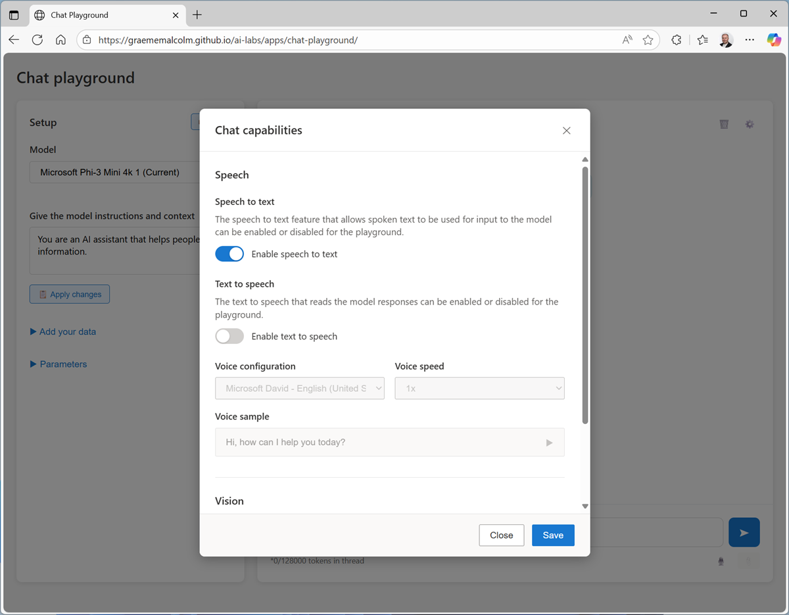
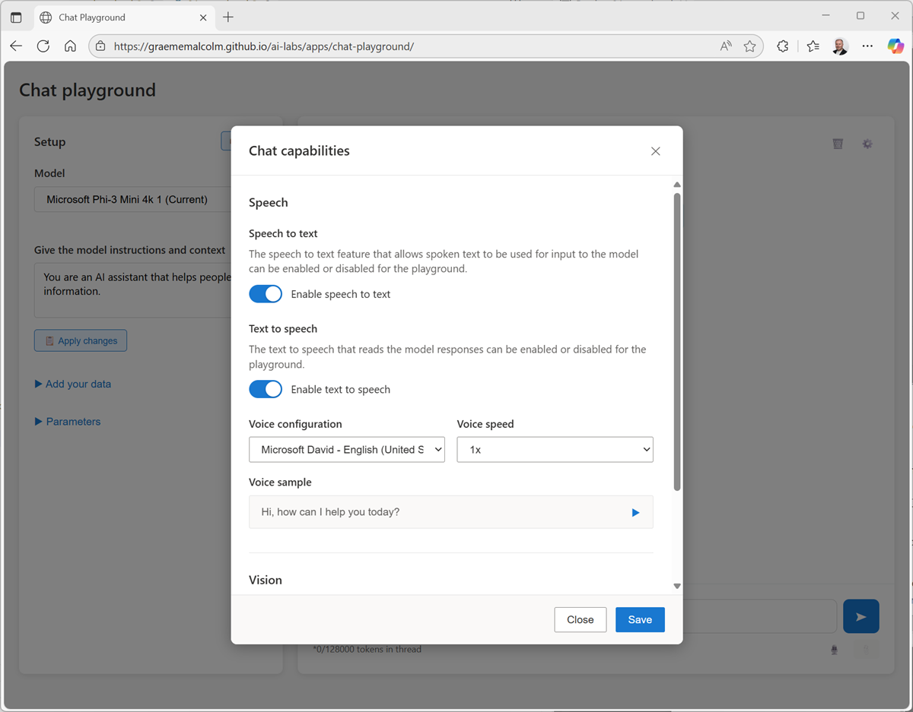
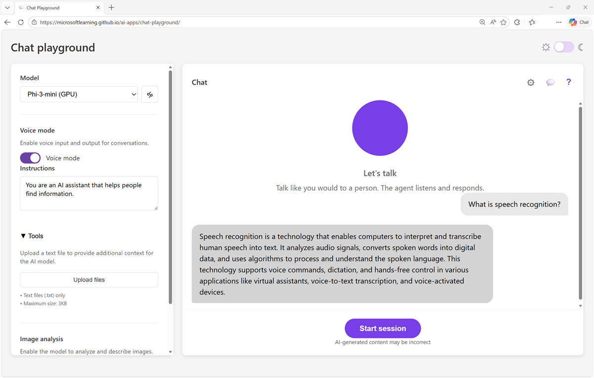

---
lab:
  title: Explore AI speech
  description: Use AI to explore speech-to-text and text-to-speech capabilities with a generative AI model.
  duration: 15
  level: 100
  islab: true
---

# Explore AI speech

<br/>**Hi, I'm Anton.**<br/>I'll be here to help you with hints and tips as you work through this lab, in which you'll interact with a generative AI model using speech. The goal of this exercise is to explore speech-to-text (STT) and text-to-speech (TTS) functionality with a generative AI model.

If you want more interactive help, you can chat with me in the *[Ask Anton](https://aka.ms/choose-anton){:target="_blank"}* app.

<details>
<strong><i><a href="https://aka.ms/choose-anton" target="_blank">Ask Anton</a></i></strong> is a generative AI agent that can answer questions about AI concepts and Microsoft Foundry technologies. It's available in two versions at <code>https://aka.ms/choose-anton</code>:
<ul>
<li><strong>Azure-based</strong>: Best experience <i>(requires an Azure subscription and deployment of a model in a Foundry project)</i>.</li>
<li><strong>Browser-based</strong>: Use a small language model in your browser <i>(reduced functionality - may be slow or work only in "basic" mode in older/lower-spec devices)</i>.</li>
</ul>
<blockquote><i>Ask Anton is <u>not</u> a supported Microsoft product or a component of Microsoft Learn or AI Skills Navigator.</i>
</blockquote>
</details>
<hr/>

To complete this lab, you need a modern browser on a computer with sufficient hardware resources to load and run the models used by the *Chat Playground* app. On older or low-spec computers, the app may run very slowly or experience errors.

> **Minimum spec**<br/>If your computer does not meet these requirements, the AI model may not run successfully. However, the app does support a failsafe *Basic* mode in which no model is used; which provides simpler, but faster responses.<br/>
>
> - 64-bit CPU, 8 cores
> - GPU (recommended)
> - 8+ GB system RAM (16 GB recommended)
> - Enough storage to cache ~300MB–800MB model assets
> - Latest Chrome / Edge / Firefox with WASM SIMD enabled/available (WebGPU support is recommended; a WASM-based fallback is provided)
> - Audio hardware (mic and speaker) required for speech functionality

This exercise should take approximately **15** minutes to complete.

## Open the Chat Playground app

Let's start by chatting with a generative AI model. In this exercise, we'll use a browser-based application to chat with a small language model that is useful for general chat solutions in low bandwidth scenarios. The app also uses Web Speech APIs for speech recognition and synthesis.

> If your browser supports WebGPU, the chat playground uses the *Microsoft Phi 3.5 Mini* model running on your computer's GPU. If not, the model runs on CPU - with reduced response-generation quality. If *that* fails, a basic mode with no model and responses retrieved from Wikipedia is activated. Performance may vary depending on the available memory in your computer and your network bandwidth to download the model. After opening the app, use the **?** (*About this app*) icon in the chat area to find out more.

1. In a web browser, open the **[Chat Playground](https://aka.ms/chat-playground){:target="_blank"}** at `https://aka.ms/chat-playground`.
1. Wait for the model to download and initialize.

    > <br>**Tip**: The first time you download a model, it may take a few minutes. Subsequent downloads will be faster.<br><br>If the model is taking a long time to load, you can cancel and start in basic mode. You can switch between available models at any time in the *Model* list.

1. View the Chat Playground app, which should look like this:

   

   > <br>**Tip**: You can switch between *light* and *dark* themes using the &#x263C; / &#x263E; toggle at the top right.

## Configure Voice mode

The Chat playground application supports *voice mode*, in which you can interact with a generative AI model using speech.

> **Note**: Voice mode depends on browser support for the Web Speech API and access to voices for speech synthesis, with a fallback to an offline speech-to-text model. The app should work successfully in most modern browsers. If your browser configuration is not compatible, you may experience errors; and ultimately voice mode may not work for you.

1. In the pane on the left, under the selected model, enable **Voice mode**

    If the **Configuration** pane is not displayed automatically on the right, open it using the **Configuration** (**&#9881;**) button above the **Chat** pane.

1. In the configuration pane, view the voices in the **Voice** drop-down list.

   

    Text-to-speech solutions use *voices* to control the cadence, pronunciation, timbre, and other aspects of generated speech. The available voices depend on your browser and operating system, and can include *local* voices installed in the operating system as well as *online* voices available for your browser.

1. Select any of the available voices, and use the *Preview selected voice* (**&#9655;**) button to hear a sample of the voice.

    Online voices are downloaded on-demand, which may take a few seconds. The app verifies that they are loaded successfully, and displays an error if not.

    > <br>**Tip**: After you've selected a voice, you can also optionally select an avatar to represent the voice agent visually!

1. When you have selected the voice you want to use, close the **Configuration** pane.

## Use speech to interact with the model

The app supports both speech recognition and speech synthesis, enabling you to have a voice-based conversation with the model.

> <br>**Tip**: Speech recognition works best in a quiet environment with a microphone or headset.

1. In the pane on the left, change the default **Instructions** to:

    ```
   You are an expert in the history of computing and AI. You provide succinct and concise responses.
    ```

1. In the **Chat** pane, use the **Start session** button to start a conversation with the model. If prompted, allow access to the system microphone.

1. When the app status is **Listening...**, say something like "*What's speech recognition?*" and wait for a response.

    *If an error occurs or the app can't detect any speech input using the default Web Speech functionality, it will automatically failover to a local speech recognition model and prompt you to retry.*

1. Verify that the app status changes to **Processing...**. The app will process the spoken input, using speech-to-text to convert your speech to text and submit it to the model as a prompt.

    > <br>**Tip**: Processing speech and retrieving a response from the model may take some time in this browser-based sample app - especially when using the CPU-based model. Be patient!

1. When the status changes to **Speaking...**, the app uses text-to-speech to vocalize the response from the model.

    *If no voices are available in your browser, the reponse will not be vocalized.*

1. After the response has been spoken, the app switches back to the **Listening...** state. Continue the conversation by speaking again (for example, "*What's speech synthesis?*").

    At any point, you can use the **[CC]** button to see a transcript of the conversation so far.

1. To end the conversation, use the **X** button. The session will end and the conversation transcript will be shown, like this:

   

1. You can use the **Start session** button to begin a new conversation. The conversation history from the previous session will not be retained.

## Summary

In this exercise, you explored the use of speech-to-text and text-to-speech with a generative AI model in a simple playground app.

The app used in this lab is based on a simplified version of the agent playground in Microsoft Foundry portal; in which Azure Speech in Foundry tools *Voice Live* capabilities can be added to an agent. While the app in this lab is limited to "speak - wait - speak" interactions, the Azure Speech Voice Live capabilities in Microsoft Foundry include multi-turn real-time conversations with support for interruptions and background noise suppression.

> <br/>If you used the [*Ask Anton*](https://aka.ms/choose-anton){:target="_blank"} app during this lab, we'd love you to [tell us about your experience with it](https://forms.office.com/r/fC0ndfBQeK){:target="_blank"}!
