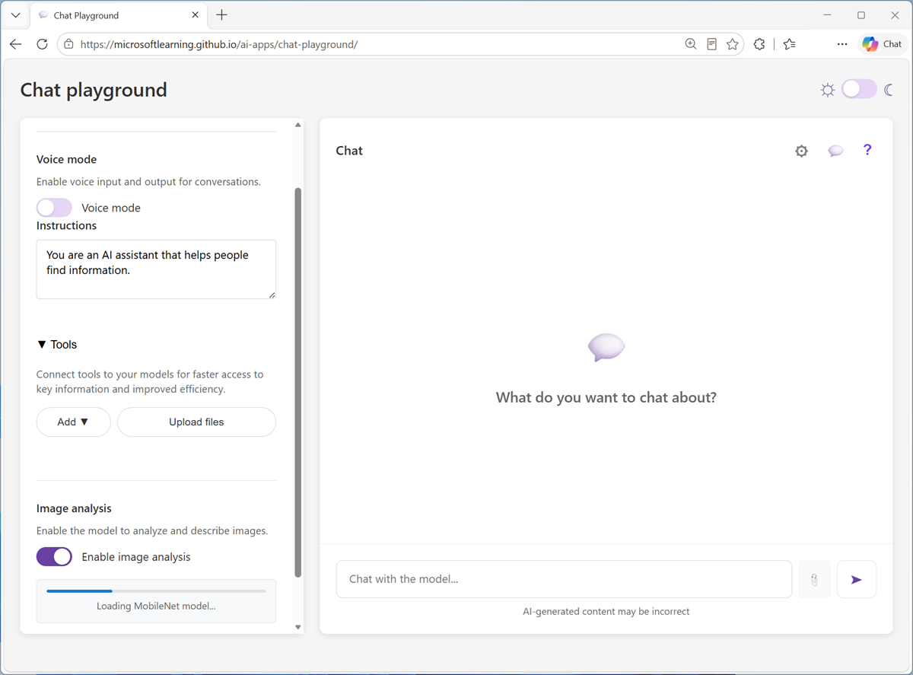
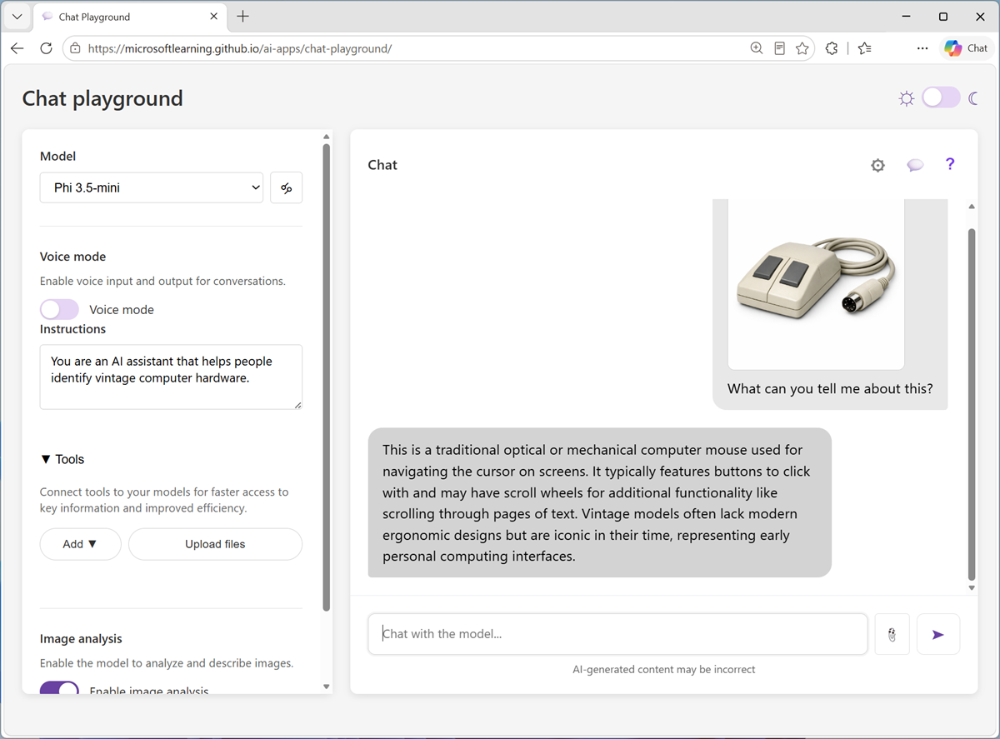

---
lab:
  title: Explore computer vision
  description: Use image analysis with a generative AI model.
  duration: 15
  level: 100
  islab: true
---

# Explore computer vision

In this exercise, you'll use a chat playground to interact with a generative AI solution that can analyze and interpret images. The goal of this exercise is to explore a common pattern for combining text and visual input in a prompt for a generative AI model.

To complete this exercise, you need a modern browser on a computer with sufficient hardware resources to load and run the models used by *Chat Playground* the app. On older or low-spec computers, the apps may run very slowly or experience errors.

> **Minimum spec**
>
> - 64-bit CPU, 8 cores
> - GPU (recommended)
> - 8+ GB system RAM (16 GB recommended)
> - Enough storage to cache ~300MB–800MB model assets
> - Latest Chrome / Edge / Firefox with WASM SIMD enabled/available (WebGPU support is recommended; a WASM-based fallback is provided)

If your computer does not meet these requirements, the AI model may not run successfully. However, the app supports a failsafe mode in which no model is used; which you may be able to use.

This exercise should take approximately **15** minutes to complete.

## Prepare for image-based chat

In this exercise you use a generative AI model in a chat playground to respond to prompts that include image data.

> **Note**: If your browser supports WebGPU, the chat playground uses the *Microsoft Phi 3.5 Mini* model running on your computer's GPU. If not, the model run on CPU - with reduced response-generation quality. If *that* fails, a basic mode with no model and responses retrieved from Wikipedia is activated. Performance may vary depending on the available memory in your computer and your network bandwidth to download the model. After opening the app, use the **?** (*About this app*) icon in the chat area to find out more.

1. In a web browser, open the **[Chat Playground](https://aka.ms/chat-playground){:target="_blank"}** at `https://aka.ms/chat-playground`.
1. Wait for the model to download and initialize.

    > **Tip**: The first time you download a model, it may take a few minutes. Subsequent downloads will be faster.  If the model is taking a long time to load, you can cancel and start in basic mode. You can switch between available models at any time in the *Model* list.

1. While waiting for the model to download, open a new browser tab, and download **[images.zip](https://aka.ms/ai-images){:target="_blank"}** from `https://aka.ms/ai-images` to your local computer.
1. Extract the downloaded archive in a local folder to see the files it contains. These files are the images you will use AI to analyze.
1. Return to the browser tab containing the chat playground and ensure a language model has downloaded. Then, in the configuration pane on the left pane, in the **Vision** section, enable **Image analysis** and wait for the computer vision model to be downloaded and initialized.

   

   > **Tip**: You can switch between *light* and *dark* themes using the &#x263C; / &#x263E; toggle at the top right.

    In the chat interface, an **Upload image** (**&#x1F4CE;**) button is enabled.

1. Click the **Upload image** button, and browse to select one of the images you extracted on your computer.

    A thumbnail of the image is added to the prompt input area.

1. Enter a prompt like `Suggest a recipe for this.`. The image is included in the message.

   

    The MobileNetV3 model is used to determine the likely subject of the image, and the results of that analysis is included in the prompt to the Phi language model. The result should be a reponse that uses the image information to answer the question.

1. Submit prompts that include the other images, such as `What desserts could I make with this?` or `How should I cook this?`

    > **Note**: Responses will vary in quality depending on the selected language model; but the image classificaton model should correctly identify the images.

1. If you want to explore further, you can upload your own images and enter appropriate prompts. The combination of a small language model and a limited computer vision model means that the quality of the responses may be highly variable compared to a true multimodal large language model!

## Summary

In this exercise, you explored the use of computer vision with a generative AI model in a chat playground.

The app used in this exercise is based on a simplified version of the chat playground in the Microsoft Foundry portal. Microsoft Foundry supports a range of multimodal models that can accept combined image and text input, enabling significantly more complex image interpretation than this simple example. Additionally, you can use the Azure Content Understanding tool to analyze images.

> **[Ask Anton](https://aka.ms/ask-anton){:target="_blank"}**  If you have questions about some of the topics covered in this exercise, *[Ask Anton](https://aka.ms/ask-anton){:target="_blank"}* is a generative AI-based agent that you can ask about AI concepts and Microsoft Foundry.  *Ask Anton is not a supported Microsoft product or a component of Microsoft Learn or AI Skills Navigator. Just a sample AI agent for you to explore as you learn about what's possible with AI.*  If you *do* check out Ask Anton, we'd love you to *[tell us about your experience with the app](https://forms.office.com/r/fC0ndfBQeK){:target="_blank"}*!
