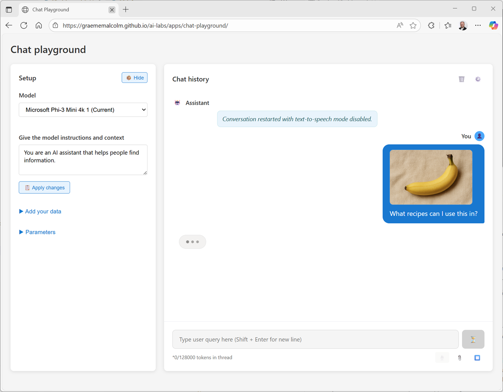

---
lab:
    title: 'Explore computer vision'
    description: 'Use image analysis with a generative AI model.'
---

# Explore computer vision

In this exercise, you'll use a chat playground to interact with a generative AI solution that can analyze and interpret images.

This exercise should take approximately **15** minutes to complete.

## Use computer vision to analyze images

Let's start by chatting with a generative AI model. In this exercise, we'll use the the **MobileNetV3** CNN-based computer vision model for image classification and the **Microsoft Phi 3 Mini model** small language model to interpret and answer questions about the images.

> **Note**: The models will run in your browser, on your local computer. Performance may vary depending on the available memory in your computer and your network bandwidth to download the model. If WebLLM models are not supported in your browser, a fallback mode with reduced functionality will be enabled.

1. In a web browser, open the **[Chat Playground](https://aka.ms/chat-playground){:target="_blank"}** at `https://aka.ms/chat-playground`.
1. Wait for the model to download and initialize.

    > **Tip**: The first time you open the chat playground, it may take a few minutes for the model to download. Subsequent downloads will be faster.

1. When the model is ready, in a new browser tab, download **[images.zip](https://aka.ms/ai-images){:target="_blank"}** from `https://aka.ms/ai-images` to your local computer.
1. Extract the downloaded archive in a local folder to see the files it contains. These files are the images you will use AI to analyze.
1. Return to the browser tab containing the chat playground, and at the top-right of the **Chat history** pane, use the **Settings** (**&#x2699;**) button to view the chat capabilities options.
1. In the **Vision** section, enable **Image analysis**. Then wait for the computer vision model to be downloaded and initialized before saving the changes.

   

    Under the chat interface, an **Upload image** (**&#x1F4CE;**) button is enabled.

1. Click the **Upload image** button, and browse to select one of the images you extracted on your computer.

    A thumbnail of the image is added to the prompt input area.

1. Enter a prompt like `What recipes can I use this in?`. The image is included in the message.

   

    The MobileNetV3 model is used to determine the likely subject of the image, and the results of that analysis is included in the prompt to the Phi language model. The result should be a reponse that uses the image information to answer the question.

1. Submit prompts that include the other images, such as `How should I cook this?` or `What desserts could I make with this?`

## Summary

in this exercise, you explored the use of computer vision with a generative AI model in a chat playground. 

Some models are *multimodal*, and natively support image-based input; while other solutions rely on using a separate image classification or object detection model. Azure AI Foundry supports a range of multimodal models, as well as third-party vision models in the Azure AI Foundry model catalog. Additionally, you can use the Azure AI Content Understanding service to analyze images.
