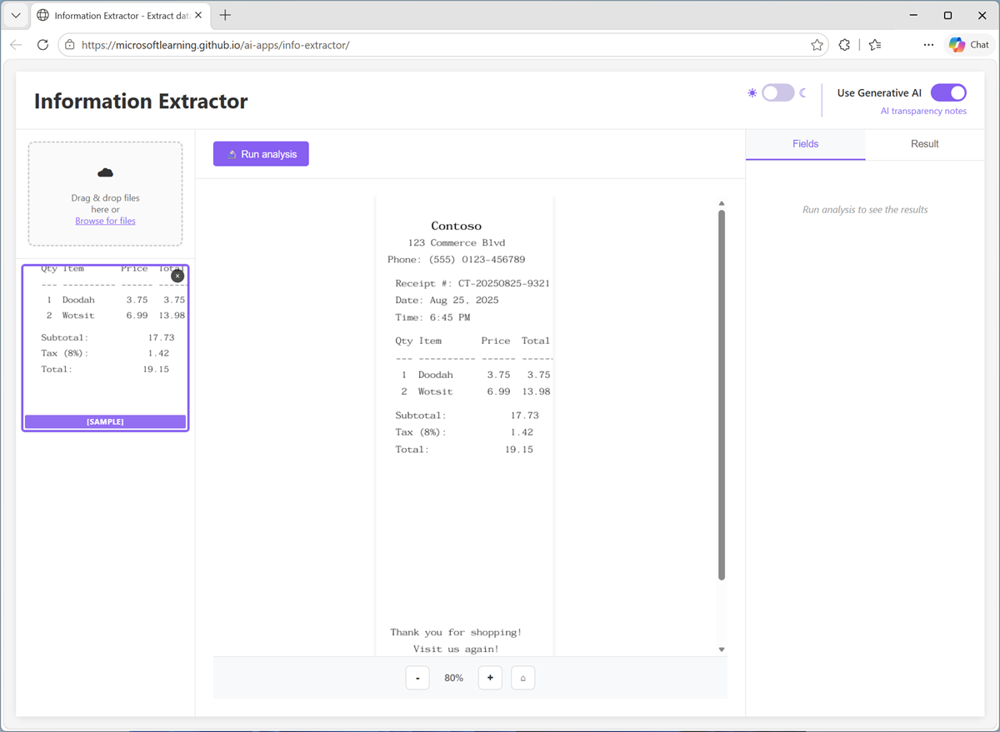
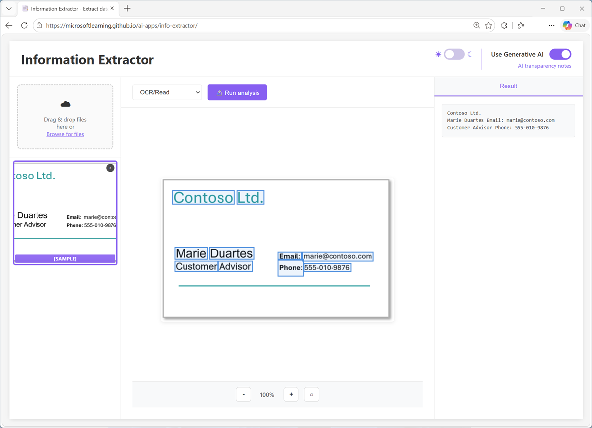
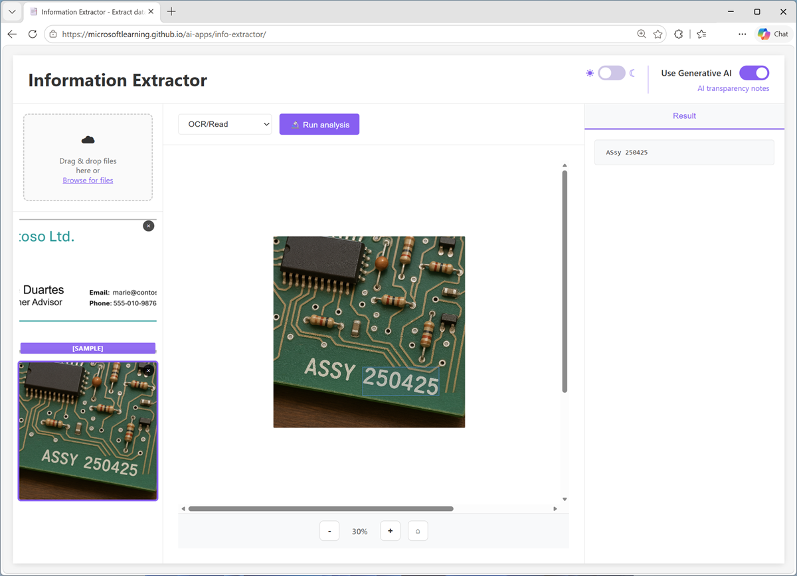
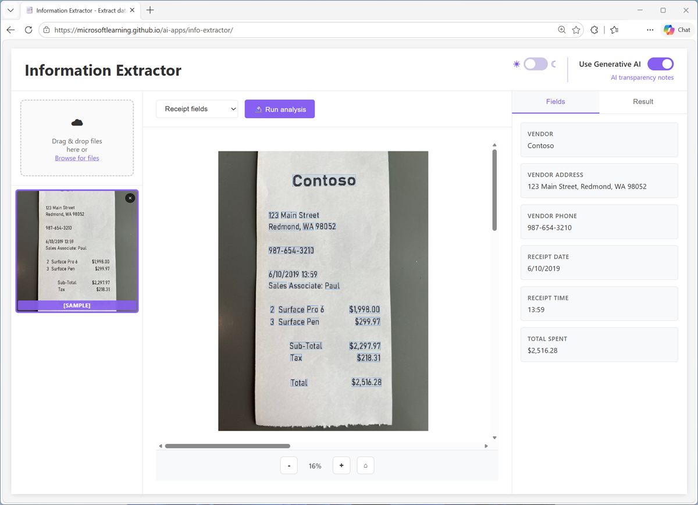

---
lab:
  title: Explore information extraction
  description: Use OCR and generative AI to extract information from documents.
  duration: 15
  level: 100
  islab: true
---

# Explore information extraction

 **Hi, I'm Anton.** I'll be here to help you with hints and tips as you work through this lab. You can also find me in the ***[Ask Anton](https://aka.ms/ask-anton){:target="_blank"}*** app; which runs an agent with generative AI model in your browser, with a *Basic* mode option for older or lower-spec computers.

> *Ask Anton is not a supported Microsoft product or a component of Microsoft Learn or AI Skills Navigator. Just a simple example AI agent for you to explore as you learn about AI.*

In this lab, you'll use optical character recognition (OCR) and generative AI to extract information from receipts. The goal of this exercise is to explore for yourself how information extraction from documents involves an OCR process to detect text, and a field extraction stage to map specific text strings to field values.

To complete this lab, you need a modern browser on a computer with sufficient hardware resources to load and run the models used by the AI agent app. On older or low-spec computers, the app may run very slowly or experience errors.

> **Minimum spec** If your computer does not meet these requirements, the AI model may not run successfully. However, the app does support a failsafe *Basic* mode in which no model is used; which provides simpler, but faster responses. 
>
> - 64-bit CPU, 8 cores
> - GPU (recommended)
> - 8+ GB system RAM (16 GB recommended)
> - Enough storage to cache ~300MB–800MB model assets
> - Latest Chrome / Edge / Firefox with WASM SIMD enabled/available (WebGPU support is recommended; a WASM-based fallback is provided)

This exercise should take approximately **15** minutes to complete.

## Extract information from images

A lot of information is held in digital format, including images that contain text - such as scanned documents or photographs. Let's explore an AI application that can help you extract text from images.

### Start the *Info Extractor* app

> If your browser supports WebGPU, the Information Extractor app used in this lab uses the *Microsoft Phi 3.5 Mini* model running on your computer's GPU. If not, the model runs on CPU - with reduced response-generation quality. If *that* fails, a basic mode with no model and responses retrieved using text processing and pattern matching is activated. Performance may vary depending on the available memory in your computer and your network bandwidth to download the model.

1. In a web browser, open the **[Information Extractor](https://aka.ms/info-extractor){:target="_blank"}** app at `https://aka.ms/info-extractor`.
1. Wait for the model to download and initialize.

    >  **Tip**: The first time you open the app, it may take a few minutes for the model to download. Subsequent downloads will be faster.  If the model is taking a long time to load, you can cancel and start in basic mode. You can switch between available modes at any time by using the *Use Generative AI* toggle.

1. While you're waiting for the model to initialize, in a new browser tab, download **[pcbs.zip](https://aka.ms/pcb-images){:target="_blank"}** from `https://aka.ms/pcb-images` and  **[receipts.zip](https://aka.ms/receipts){:target="_blank"}** from `https://aka.ms/receipts` to your local computer. You'll use the the app to extract information from the images in these archives.

1. Return to the browser tab containing the Information Extractor app, which should look similar to this:

    

    >  **Tip**: You can switch between *light* and *dark* themes using the &#x263C; / &#x263E; toggle at the top right.

### Use OCR to read text in an image

Suppose you want to find information related to a piece of computer hardware or some other item with information printed on it. A first step might be to digitize the text so you can use it to look up details on the Internet or in an AI assistant. You can use an AI technique called optical character recognition (OCR) to "read" text in images.

1. In the Information Extractor app, after the model has initialized, ensure that **OCR/Read** is selected and that the sample business card image is loaded.
1. Run analysis on the sample image. When analysis is complete, view the text that has been extracted in the **Result** pane on the right.

    

1. Extract the downloaded **pcb-images.zip** archive in a local folder to see the files it contains. These files are images of printed circuit boards that contain text.
1. Upload any of the PCB images, and view it in the main content area of the app.
1. Run analysis on the uploaded image and review the results.

    

1. Repeat the process to analyze the other PCB images you downloaded.

    >  **Tip**: Try uploading any images that contain legible text. The OCR model used in the app is basic, so the quality of your results may vary!

### Extract fields from receipts

Now suppose you need to extract data fields from scanned receipts to help automate an expense claim solution. You can use OCR to identify text and its location in images, and then use a generative AI model to associate individual text values with specific data fields - such as company names, phone numbers, dates, amounts, and so on.

1. In the Information Extractor app, switch from the **OCR/Read** option to **Receipt Fields**.

    The user interface is rest and a sample image of a receipt is loaded. The pane on the right now includes a tab for **Fields** as well as the original **Results** tab.

1. Run analysis on the sample receipt image, and wait for the OCR and field extraction processes to complete.

    >  **Tip**: Field extraction may take some time when using the AI model. Be patient!

    When the analysis is complete, the specific values associated with a receipt are identified by the field extraction process and listed in the **Fields** pane. The full OCR text results are in the **Result** tab.

    

1. Extract the downloaded **receipts.zip** archive in a local folder to see the files it contains.
1. Upload any of the receipt images, and view it in the main content area of the app.
1. Run analysis on the uploaded image and review the fields and results.
1. Repeat the process to analyze the other receipt images you downloaded (or a scanned receipt of your own).

## Summary

In this exercise, you explored how AI can be used to extract information from content using a combination of OCR and generative AI.

In Microsoft Foundry, the Content Understanding tool is a multimodal information extraction solution that you can use to analyze documents, images, audio files, and videos.

>  If you used the [*Ask Anton*](https://aka.ms/ask-anton){:target="_blank"} app during this lab, we'd love you to [tell us about your experience with it](https://forms.office.com/r/fC0ndfBQeK){:target="_blank"}!
