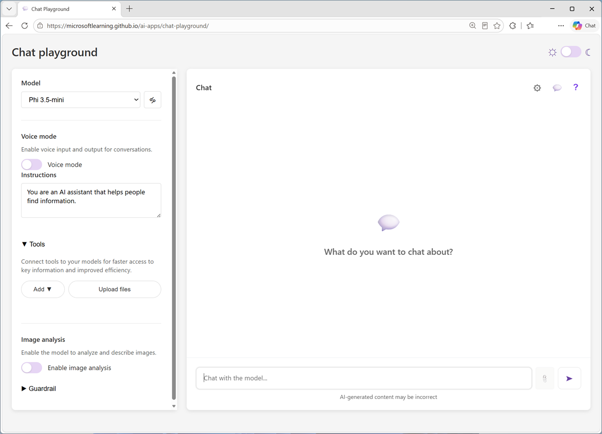
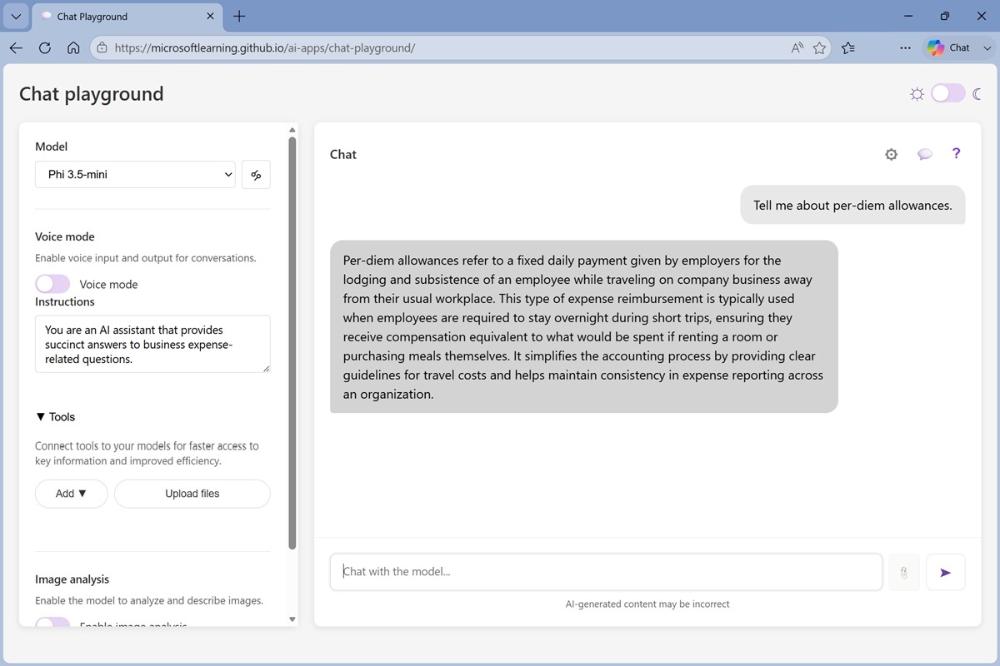
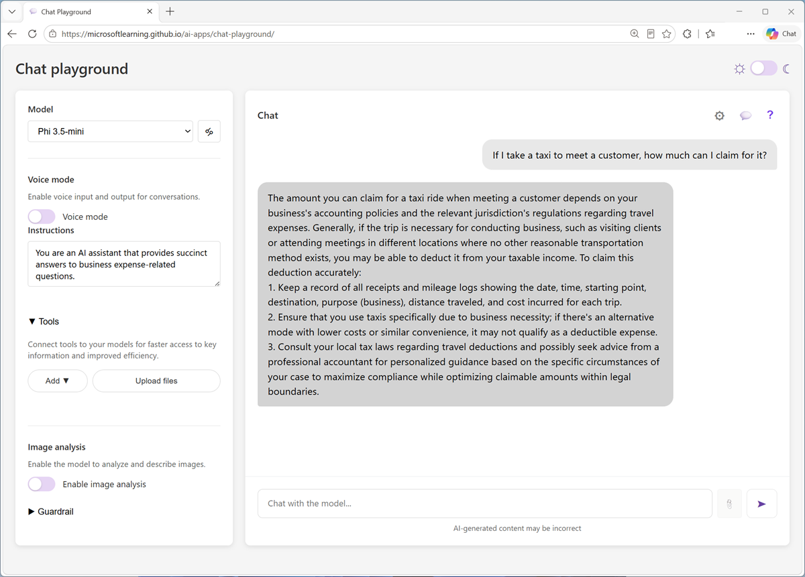
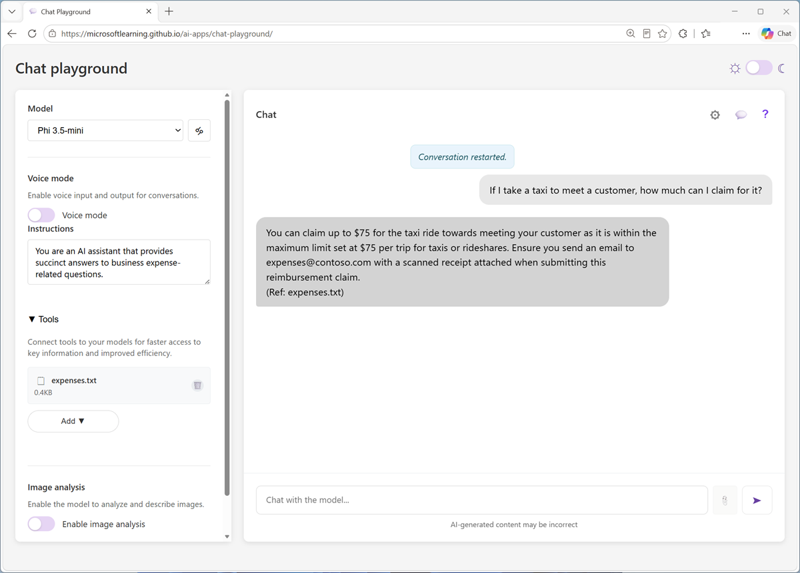

---
lab:
  title: Explore retrieval augmented generation (RAG)
  description: Use a chat playground to explore how to use RAG to ground prompts in knowledge.
  duration: 15
  level: 100
  islab: true
---

# Explore retrieval augmented generation (RAG)

 **Hi, I'm Anton.** I'll be here to help you with hints and tips as you work through this lab.

If you want more interactive help, you can chat with me in the *[Ask Anton](https://aka.ms/choose-anton){:target="_blank"}* app.

<strong><i><a href="https://aka.ms/choose-anton" target="_blank">Ask Anton</a></i></strong> is a generative AI agent that can answer questions about AI concepts and Microsoft Foundry technologies. It's available in two versions at <code>https://aka.ms/choose-anton</code>:
<ul>
<li><strong>Azure-based</strong>: Best experience <i>(requires an Azure subscription and deployment of a model in a Foundry project)</i>.</li>
<li><strong>Browser-based</strong>: Use a small language model in your browser <i>(reduced functionality - may be slow or work only in "basic" mode in older/lower-spec devices)</i>.</li>
</ul>
<blockquote><i>Ask Anton is <u>not</u> a supported Microsoft product or a component of Microsoft Learn or AI Skills Navigator.</i>
</blockquote>

In this exercise, you'll use a chat playground to interact with a generative AI model and ask questions related to expense claims policies. You'll then explore how adding a knowledge source to implement *retrieval augmented generation (RAG)* can produce more relevant responses.

To complete this exercise, you need a modern browser on a computer with sufficient hardware resources to load and run the models used by the *Chat Playground* app. On older or low-spec computers, the apps may run very slowly or experience errors.

> **Minimum spec** If your computer does not meet these requirements, the AI model may not run successfully. However, the app does support a failsafe *Basic* mode in which no model is used; which provides simpler, but faster responses. 
>
> - 64-bit CPU, 8 cores
> - GPU (recommended)
> - 8+ GB system RAM (16 GB recommended)
> - Enough storage to cache ~300MB–800MB model assets
> - Latest Chrome / Edge / Firefox with WASM SIMD enabled/available (WebGPU support is recommended; a WASM-based fallback is provided)
> - Audio hardware (mic and speaker) required for speech functionality

This exercise should take approximately **15** minutes to complete.

## Chat with a model

Let's start by using a chat interface to submit prompts to a generative AI model. In this exercise, we'll use a small language model that is useful for general chat solutions in low bandwidth scenarios.

> **Note**: If your browser supports WebGPU, the chat playground uses the *Microsoft Phi 3.5 Mini* model running on your computer's GPU. If not, the model runs on CPU - with reduced response-generation quality. If *that* fails, a basic mode with no model and responses retrieved from Wikipedia is activated. Performance may vary depending on the available memory in your computer and your network bandwidth to download the model. After opening the app, use the **?** (*About this app*) icon in the chat area to find out more.

1. In a web browser, open the **[Chat Playground](https://aka.ms/chat-playground){:target="_blank"}** at `https://aka.ms/chat-playground`.
1. Wait for the model to download and initialize.

    The first time you download a model, it may take a few minutes. Subsequent downloads will be faster.

    >  **Tip**: If the model is taking a *very* long time to load, you can cancel and start in ***Basic*** mode. You can switch between available models at any time in the **Model** list; but on older or lower-spec computers, you may have a better experience in basic mode.

    When ready, the Chat Playground looks like this:

    

    >  **Tip**: You can switch between *light* and *dark* themes using the &#x263C; / &#x263E; toggle at the top right.

1. In the pane on the left, in the **Instructions** text area, change the model's instructions to `You are an AI assistant that provides succinct answers to business expense-related questions.`

    >  **Tip**: Instructions, sometimes known as a *system prompt*, are used to provide the model with an overall context for its responses. You can use the system prompt to provide guidelines about format, style, and constraints about what the model should and should not include in its responses.

1. In the chat pane, enter the prompt `Tell me about per-diem allowances.` and review the response.

    

1. Now try a follow-up question: `How are they reimbursed?`

    >  **Tip**: Generative AI chat applications often include chat history in the prompt; so the context of the conversation is retained between messages (for example, in the follow-up prompt *How are they reimbursed?*, "they" is interpreted as relating to per-diem allowances).  In *Basic* mode, the conversation history is not retained; so the follow up prompt results in a new Wikipedia query.

    So far, the model has successfully answered some general questions related to expense claims based on the data it was trained with.

1. In the chat playground, at the top of the chat pane, use the **New chat** (&#128172;) button to restart the conversation.
1. Enter the prompt `If I take a taxi to meet a customer, how much can I claim for it?` and review the response.

    

    The model responds with a general answer (in *Basic* mode, it may be completely unrelated to expense claims).

    If we want to use the model to power an agent that advises employees in an organization about expense claims, it needs more specific knowledge of the organization's expense policies.

    Let's fix that.

## Add a knowledge source

1. Open a new browser tab, and view the **[expenses guide](https://aka.ms/expenses-txt){:target="_blank"}** at `https://aka.ms/expenses-txt`. We'll use this to ground the model, so it has some context for questions about expenses.

    >  **Tip**: This is a very small document for the purposes of this exercise. In a real scenario, an AI agent might have access to large volumes of data spread across multiple sources.

1. Save the **expenses.txt** file on your local computer.
1. Return to the tab containing the chat playground, and in the pane on the left, in the **Tools** section, add select **Upload files**.
1. Upload the **expenses.txt** file. After it's been been uploaded, it's listed in the **Tools** section and the chat is automatically restarted.
1. Enter the prompt `If I take a taxi to meet a customer, how much can I claim for it?` and view the response.

    This time the response should be informed by the information in the expenses data source.

    

    Note that the response includes a citation for the source of the information (the *expenses.txt* file you uploaded).

1. Try more expense-related prompts, such as `Can I buy the customer lunch?` or `What is a purchase order?` and verify that the uploaded file is referenced if any relevant context is found in it, but not if a search of the file returned no relevant information for the prompt.

    >  **Tip**: When you uploaded the file, a simple keyword index was created. You can select the file icon to view this index. In a real-world RAG solution, the index would be more comprehensive and most likely be vector-based and support *semantic* matching in addition to *keyword* matching.

## Summary

In this exercise, you explored a generative AI model in a chat playground, and saw how a model's responses can be affected by adding a knowledge source that provides additional content in a RAG implementation.

The interface and techniques used in this exercise are similar to those in Microsoft Foundry portal; a platform for building AI apps and agents in the Microsoft Azure cloud. Additionally, Foundry includes *Foundry IQ*; a managed knowledge layer that makes it easier to build enterprise-scale RAG solutions with multiple, shared knowledge stores.

>  If you used the [*Ask Anton*](https://aka.ms/choose-anton){:target="_blank"} app during this lab, we'd love you to [tell us about your experience with it](https://forms.office.com/r/fC0ndfBQeK){:target="_blank"}!
